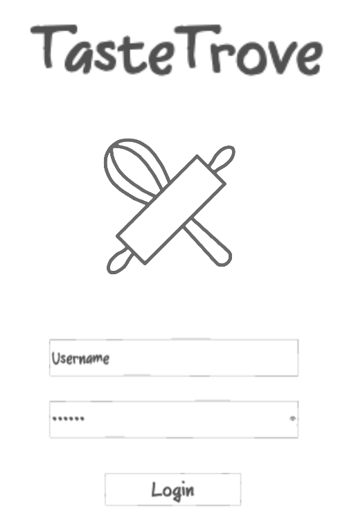
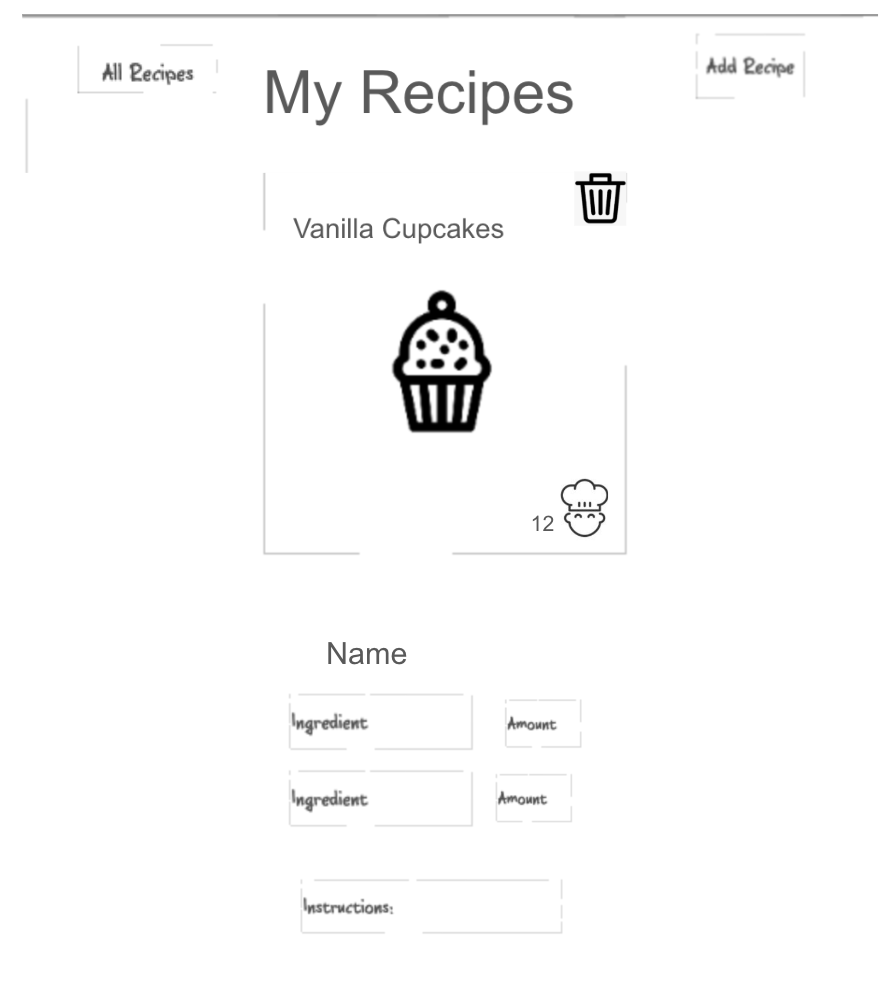
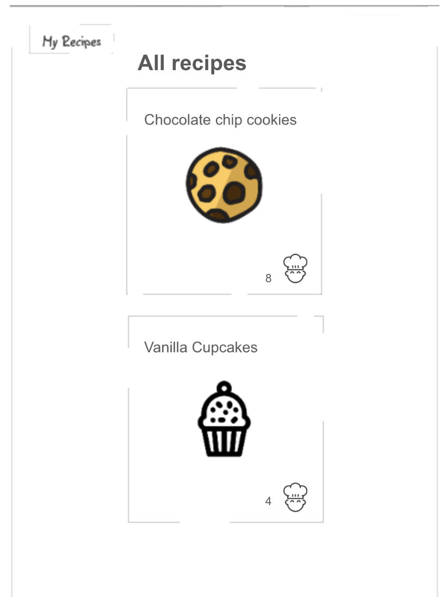
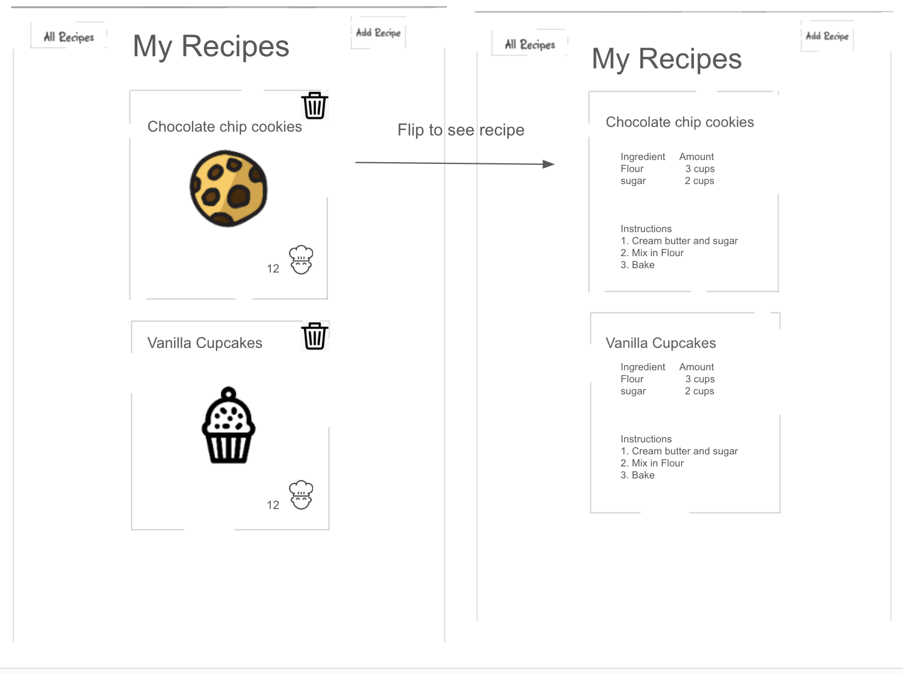

# Taste Trove #
## Description Deliverable ##

### Elevator Pitch ###

Do you like cooking or baking? Do you wish you had access to your friends and family’s cookbook recipes? My application, Taste Trove, allows users to post recipes and see those posted by others. Once signed in, scroll through mouth watering recipes till you find one that fits your tastes. Use the number of 'makes' on a recipe to see what is most popular. Click the 'add recipe' button to share one of your own.

### Design ###

### Key Features ###
- Secure login
- Add/delete recipes
- Display user’s recipes
- Display all recipes
- ‘Make’ a recipe
- Users, recipes, ‘makes’, persistently stored

### Technologies ###
I will use the required technologies in the following ways:

- HTML: Four HTML pages using the proper HTML structure. One for login, one for the user’s recipes, one for all recipes and one to add recipes.

- CSS: Attractive design that works for different screen size. Scroll through recipes. Colors and fonts that stand out.

- JavaScript: Login, adding/delete recipes, flip to see recipe, increase 'makes' for a recipe, toggle between user recipes and all recipes.

- Service: Login, retrieving recipe info.
  
- Database/Login:
  - Users login info
  - Recipes
  - Who posted each recipe
  - ‘Makes’ on a recipe

- WebSocket: Users can see each other's recipes and its number of 'makes'.

- React: Wrap application into React web framework.

## HTML Deliverable ##
For this deliverable I built the structure of my application using HTML.

- HTML: Four HTML pages: login, user recipes, all recipes, and add a recipe.
- Links: 
  - Login page links to all recipes.
  - all recipes links to login and user recipes.
  - Add a recipe has a button that links to user recipes.
- Text: Each recipe has a name, ingredients, and instructions.
- Images:
  - The login page will display a random dessert image from a 3rd party application.
  - Each recipe has an image.
- DB/Login:
  - Login page with username and password.
  - The users, their recipes, and their makes are stored.
- WebSocket:
  - Users can see recipes posted by other users.
  - Users can see how many ‘makes’ a recipe has received.

## CSS Deliverable ##
For this deliverable I styled my application into its final appearance.

- Header, footer, and main content body
- Navigation elements: I altered my nav to display the links next to each other with space in-between and altered their font-size.
- Window resizing: The app looks good on computers and smaller devices.
- Application elements: Used borders, colors, spacing, flippable cards, etc, to create an attractive application.
- Application text content: Consistent fonts. When recipe instructions are too long they become scrollable.
- Application images: Image on login page as stand in for 3rd party web-api. Size increases/decreases based on screen size.

## JavaScript Deliverable ##
For this deliverable I added JavaScript to my application so that it works for a single user. There are placeholders for future add-ons.

- Login: When you click login, it takes the user to the My Recipes page.
- Database:
  - Login: It stores the username separately but also adds it to a list of known usernames in local storage.
  - Add Recipe: When the user submits a recipe form, their recipe is added to the list of recipes for that user in local storage.
  - My Recipes: It takes the recipes from local storage for that user and displays them.
  - All Recipes: It takes all recipes from local storage and displays them.
- WebSocket: I used an Interval function to periodically call a function which increases the ‘makes’ on a random recipe. This will be replaced with WebSocket later.
- Application logic:
  - users can add new recipes.
  - users can ‘make’ recipes.
  - users can delete their own recipes.
  - users can see recipes made by all users.
 
## Service Deliverable ##
For this deliverable I added backend endpoints that receive recipe makes, new recipe posts, and images.

- Node.js/Express HTTP service: done.
- Static middleware for frontend: done.
- Calls to third party endpoints: On the login page it displays a random food image. (takes a second to show up, might have to return back to page later)
- Backend service endpoints: Endpoints for uploading images to the server, deleting/adding/updating recipes, and fetching recipes.
- Frontend calls service endpoints: The frontend calls the endpoints using fetch.

## Login Deliverable ##
For this deliverable I associate the recipes being added with the logged in user.

- MongoDB database created: done.
- Stores recipes and username/password data in MongoDB: done.
- User registration: Creates a new account in the database.
- Existing user: When recipes are added they are associated with the user that created them in the database.
- Use MongoDB to store credentials and recipes: Stores user data in one table (username, password, authtoken) and recipe data in another table (recipe info, which includes username).
- Fetches data: Uses recipes from database to load pages. Uses credential data to authenticate users before fetching user recipes.
- Restricts functionality: It will not load the user's recipes until the cookie is authenticated. On the frontend you cannot see or add recipes unless logged in. You must login with an existing username/password or create an account with a username that is not in the database.

## WebSocket Deliverable ##
For this deliverable I used webSocket to update the ‘makes’ on the recipes in realtime.
- Backend listens for WebSocket connection: done.
- Frontend makes WebSocket connection: done.
- Data sent over WebSocket connection: done.
- WebSocket data displayed - All recipe ‘makes’ display in real time.

