1/10/2024: code repositories

ls -la
show hidden directories. Use to see .git

-git checkout to go back to a previous version
-you can edit/commit changes directly from github
-git fetch: see latest info about changes on git
-git status: see the differences b/t clone and see if we’re missing a commit. 
Also tells us if we added stuff but haven’t yet committed.
-git -am “message” : Adds all new files and then commits with the message

print “more text” >> hello.txt means concatenate to the file
print “more text” > hello.txt means overwrite
git diff HEAD HEAD~1 //compare version with previous version
git log
Merge Conflicts

Configure your own commands:
git config --global -l
alias.s=status
alias.l=log --all --graph --decorate --oneline --pretty=format:'%C(bold 
red)%d%Creset %cr %C(bold yellow)%h%Creset - %C(green)%an%Creset %s'
pull.rebase=true
core.editor=code

-readme.md: Use to describe modifications and alterations you make to 
startup.
-notes.md: track what you have learned. will be used for the midterm/final

Fork: Create a copy of a github repository. Maintains a link to the original 
repository so you can pull down updates.

**1/19: EC2**
http://52.87.41.204/
ssh -i cs260/[filename] ubuntu@52.87.41.204
ssh -i cs260/[filename] ubuntu@tastetrove.click

**1/22: Caddy, HTTPS, TLS, and certificates**
Caddy
web service that listens for HTTP requests. Once received, it either gives the requested static files or routes the files to another web service (gateway/reverse proxy)
creation/rotation of web certificates
serves all static HTML/CSS/JS

FILES
Configuration file: ~/Caddyfile: for routing HTTP requests, determine location of HTML files,etc. Don’t change.
HTML files: ~/public_html: directory of files that Caddy servers up when requests are made
ex: request http://yourdomainname/index.html looks for index.html in public_html

HTTPS, TLS, and web certificates
HTTPS: HTTP with negotiated secure connection that happens before data is exchanged. All data encrypted w TLS protocol (negotiate shared secret and use to encrypt)
negotiation includes exchange of web certificate that identifies the dns of the server creating the server connection. Browser makes sure that certificate name matches domain name in URL.

Web Certificates
generated by 3rd party using private key encryption
once you have certificate for domain name, browser can validate
Let’s encrypt lets you make a web certificate for free.
Caddy: uses lets encrypt to generate a web certificate every time a HTTPS request is made for a domain that Caddy doesn’t have a certificate for. It then asks lets encrypt to verify that the domain is owned by the requester

curl -v -s https://byu.edu > /dev/null //see the negotiation that happens

EDIT Caddy configuration:
cd ~
vi Caddyfile
i //then make changes
esc
:wq + enter
sudo service caddy restart

**1/24: The Console, editors**
pwd: tells you what directory you are in
ls -la: see all files including hidden ones
echo - Output the parameters of the command
cd - Change directory
mkdir - Make directory
rmdir - Remove directory
rm - Remove file(s)
mv - Move file(s)
cp - Copy files
ls - List files
curl - Command line client URL browser
grep - Regular expression search
find - Find files
top - View running processes with CPU and memory usage
df - View disk statistics
cat - Output the contents of a file
less - Interactively output the contents of a file
wc - Count the words in a file
ps - View the currently running processes
kill - Kill a currently running process
sudo - Execute a command as a super user (admin)
ssh - Create a secure shell on a remote computer
scp - Securely copy files to a remote computer
history - Show the history of commands
ping - Check if a website is up
tracert - Trace the connections to a website
dig - Show the DNS information for a domain
man - Look up a command in the manual

|: Take output from command on left and pass as input to command on right
>: redirect output to file, overwrite file if exists
>>: redirect output to file, append to if exists.

Editors
VScode: editor for daily coding 
VI: when you are shelled into your production environment and need a simple, but powerful, console based editor for quickly editing text files.

VI
To use: change directory to one with some code to edit.
vi index.html
command mode: default. 
To edit, type i to enter insert mode,
esc to escape,  :w to save, :q to quit
https://vim.rtorr.com/

VIM commands
:h -> help
i -> insert mode. Use ESC to exit
u -> undo
ctrl-r -> redo
gg -> go to beginning of file
G -> go to end of file
/ -> search for patterns
n -> next search match
N -> previous search match
v -> visually select text
y -> yank/copy selected text to clipboard
p -> past clipboard
ctrl -wv -> split window vertically
crl -ww -> toggle windows
ctrl -wq -> close current window
:e -> open file
:w -> write file (save)
:q -> quit, :q! to not save

**1/26: codePen, HTML intro, structure, input, media**
CodePen: immediately renders code in preview window

To submit assignments that use codpen
create new pen or fork existing example
do stuff, saving occasionally
submit pen URL in canvas w something you learned

HTML introduction    MDN HTML
Text is valid in html. HTML is mostly about structure
elements have open/close tags
each HTML element has attributes
class: designates the element as classified into name group of elements

Hello world

hyperlink: anchor a with attribute href
<a href="https://byu.edu">Go to the Y</a>

doctype at the top to tell browser the type and version of the document
<!DOCTYPE html>
<html lang="en">
  <body>
    <main>
      <h1>Hello world</h1>
      

        HTML welcomes you to the amazing world of
        web programming.
      

      
What will this mean to you?

      
Learn more <a href="instruction.html">here</a>.

    </main>
  </body>
</html>
<!-- commented text -->

list of HTML elements HTML introduction
| Element | Meaning                                      |
| ------- | -------------------------------------------- |
| html    | page container                              |
| head    | header info                                 |
| title   | title of page                               |
| meta    | metadata for page like character set or viewport settings |
| script  | javascript reference. External reference or inline |
| include | external content reference                  |
| body    | entire content body of the page             |
| header  | header of main content                      |
| footer  | footer of main content                      |
| nav     | navigational inputs                         |
| main    | main content                                |
| section | section of main content                     |
| aside   | aside content from main content             |
| div     | block division of content                   |
| span    | inline span of content                      |
| h<1-9>  | text heading, h1 is largest size           |
| p       | paragraph of text                           |
| b       | bring attention                             |
| table   | Table                                       |
| tr      | table row                                   |
| th      | table header                                |
| td      | table data                                  |
| ol, ul  | ordered/unordered                          |
| li      | list item                                   |
| a       | anchor text to hyperlink                    |
| img     | image                                       |
| dialog  | interactive component like confirmation    |
| form    | collection of user input                    |
| input   | user input field                            |
| audio   | audio                                       |
| video   | video                                       |
| svg     | scalable vector graphic content             |
| iframe  | inline frame of another HTML page           |

EXAMPLE TABLE 
<!--
<table border="1">
    <tr>
        <th>Header 1</th>
        <th>Header 2</th>
        <th>Header 3</th>
    </tr>
    <tr>
        <td>Data 1</td>
        <td>Data 2</td>
        <td>Data 3</td>
    </tr>
</table>
-->
canIUse
Special characters
if request https://google.com you get index.html

Special characters
<!--
& -> &amp;
< -> &lt;
> -> &gt;
“ -> &quot;
‘ -> &apos;
emoji -> &#128512;
-->

☑ Structure
common structure elements: body, header, footer, main, section aside, p, table, ol/ul, div, and span
block element: distinct block in flow of structure
inline element: do not disrupt flow. Might just be in the middle of a line.

☑ Input
form: input container and submission <form action=”form.html” method=”post>
fieldset: labeled input group
input: multiple types of user input <input type = “” />
select: selection drop down <select><option>1</option></select>
optgroup: grouped selection dropdown: <optgroup><option>1</option></optgroup>
option: selection option <option selected>option2</option>
textarea: multiline: <textarea></textarea>
label: individual input label: <label for = “range”>Range: </label>
output: output of input: <output for = “range”>0</output>
meter: display value w known range <meter min = “0” max=”100” value=”50”></meter>

-form: 
<form action="submission.html" method="post">
  <label for="ta">TextArea: </label>
  <textarea id="ta" name="ta-id">
Some text
  </textarea>
  <button type="submit">Submit</button>
</form>

-input element: set it using the type attribute
<label for="checkbox1">Check me</label> <input type="checkbox" name="varCheckbox" value="checkbox1" checked />

EXAMPLE input
<input type="text" name="username" placeholder="Enter your username">

some input elements have built-in validation.
required attribute to say that there has to be value inside
pattern attribute for text/search/url/tel/email/password to provide regex for input
☑ Media
img, audio, video, svg, canvas
media tags referencing external media have url as attribute. Keep link as relative as possible (not full link) 
Audio, controls attribute to let user able to control playback, autoplay, loop
<audio controls src="testAudio.mp3"></audio>
video: video element, src controls autoplay
<video controls width="300" crossorigin="anonymous">
  <source src="https://commondatastorage.googleapis.com/gtv-videos-bucket/sample/BigBuckBunny.mp4" />
</video>

internal media: svg, canvas
svg: scalable vector graphics
<svg viewBox="0 0 300 200" xmlns="http://www.w3.org/2000/svg" stroke="red" fill="red" style="border: 1px solid #000000">
  <circle cx="150" cy="100" r="50" />
</svg>

canvas: draw/animate
<canvas id="canvasDemo" width="300" height="200" style="border: 1px solid #000000"></canvas>

**1/29: **
Simon HTML ☑ 
4 html pages
main level should be index.html
index.html, play, scores, about

**make sure to be in project directory
./deployFiles.sh -k <yourpemkey> -h <yourdomain> -s simon
./deployFiles.sh -k ~/keys/cs260/cs260.pem -h cs260.click -s simon-html

ssh -i ~/cs260/Lofthouse260.pem ubuntu@tastetrove.click
./deployFiles.sh -k ~/cs260/Lofthouse260.pem -h tastetrove.click -s startup

 sudo systemctl restart caddy.service 
ps -ef | grep index.js
lsof -i :4000
lsof -i :3000 //processes running on port 3000
 

Startup HTML
all pages/footers/images/content to represent everything the application does

PARTS
application data: rendering of application data
authentication: input for account/login, display user’s name
database: rendering of data in the database ex: high scores
hard code some recipes in there
websocket
number of makes on a recipe
wild recipe
./deployFiles.sh -k ~/keys/production.pem -h yourdomain.click -s startup

**1/31: CSS**
CSS introduction 
CSS focused on defining rulesets
A rule is a selector (selects elements to apply rule to) and one or more declarations representing the property to style with the given property rule

EX: select all paragraph elements, 4 declarations (sans-serif font, font size twice as big, navy text, gray shadow)

Three ways to associate CSS to with HTML
-style attribute inside HTML element to assign declarations: 
CSS

-style element to define CSS rules. Should be in the head element to make the rules apply to all elements in doc.
<head>
  
</head>
<body>
  
CSS

</body>

-Create a hyperlink reference to an external file containing CSS rules. Must be in head element.
<link rel="stylesheet" href="styles.css" />

elements inherit the rules applied to their parents. If an element has a different property than their parent, the lower level will override the parent.
<body>
  
CSS

</body>
body {
  color: red;
}
p {
  color: green;
}
span {
  color: blue;
}

box model: a box of nested boxes
ORDER: content, padding, border, margin

Selectors
Element type selector

body { //all children of the body will have this ond
  font-family: sans-serif;
}
section {
  background: #eeeeee;
  padding: 0.25em;
  margin-bottom: 0.5em;
}
Combinators
section h2 { //apply this to h2 which are descendents of section elements
  color: #004400;
}
Descendant: body section {}: Any section that is a descendant of a body
Child: section > p{}: Any p that is a direct child of a section
General Sibling: p ~ div{}: Any p that has a div sibling
Adjacent sibling: p + div{}: Any p that has adjacent div sibling

h2 ~ p {//paragraphs that are siblings of a level two heading
  padding-left: 0.5em;
}

Class selector
.summary { //do this to things that have class="summary"
  font-weight: bold;
}
p.summary { //all p elements with class = "summary"
  font-weight: bold;
}
//
Summary

ID selector
#physics { //apply to all w id=physics
  border-left: solid 1em purple;
}

p[id="6"]{}

Attribute selector
select based on attributes
p[class='summary'] {
  color: red;
}

Pseudo selector MDN.
select based on positional relationships, mouse interaction, hyperlink, attributes
section:hover { //when mouse hover over the text
  border-left: solid 1em purple;
}

 Declarations
specify property and value to assign when rule selector matches 1+ elements
BIG table of stuff
Units
px: pixels
pt: points
in: inches
cm: centimeters
%: percentage of parent element
em: multiplier of width of the letter m in the parent’s font.
rem: multiplier of width of letter m in root’s font
ex: multiplier of height of element’s font
vw: percentage of viewport’s width
vh: percentage of viewport’s height
vmin: percentage of viewport’s smaller dimension
vmax: percentage of viewport’s larger dimension

p {
  width: 25%;
  height: 30vh;
}

Color
keyword
RGB hex: #00FFAA22
RGB function: rgb(128, 255, 128, .5)
HSL: hsl(180, 30%, 90%, .5)

**2/2: Fonts Animation ☑ CSS practice**
Fonts: https://codepen.io/leesjensen/pen/zYaLgVW

4 font families: Serif, sans-seif, fixed, symbol
import fonts
@font-face {
  font-family: 'Quicksand';
  src: url('https://cs260.click/fonts/quicksand.woff2');
}

p {
  font-family: Quicksand;
}
open source fonts 
-@import url('https://fonts.googleapis.com/css2?family=Rubik Microbe&display=swap');

p {
  font-family: 'Rubik Microbe';
}

Animation
STEPS to animate: (zooming in on text)
keyframes: define the key points of animation and CSS will create a smooth transition from one keyframe to another

p {
  text-align: center;
  font-size: 20vh;

  animation-name: demo; //animate, using keyframes named demo
  animation-duration: 3s; //animation lasts 3 seconds
}

@keyframes demo {
  from {
    font-size: 0vh; //frame
  }

  95% {
    font-size: 21vh; //frame
  }

  to {
    font-size: 20vh; //frame
  }
}

https://codepen.io/kgg511/pen/YzgrExd

**⅖: Responsive design. Grid, Flex: **
reconfigure interface to accommodate screen size
CSS display element: change how HTML element is displayed

None

.none {
  display: none;
}

tell browser to not scale the page (include in HEAD)
<meta name="viewport" content="width=device-width,initial-scale=1" />

Float: Allows inline elements to wrap around it. right/left/none
aside {
  float: right;
  padding: 3em;
  margin: 0.5em;
  border: black solid thin;}

Media queries: @media selector detects size of device and applies CSS to it.
@media (orientation: portrait) {
  div pr{
    transform: rotate(270deg); 
//if screen is in portrait mode (short side on top) then rotate all div 270 degrees
  }
}

//if in portrait mode, disappear
@media (orientation: portrait) {
  aside {
    display: none;
  }
}
Grid and Flexbox both automatically resize child elements

Grid
When you want to display group of child elements in responsive grid
use the display property and put grid
.container {
  display: grid; //grid
  grid-template-columns: repeat(auto-fill, minmax(300px, 1fr)); 
  grid-auto-rows: 300px; //fixed height of 300 pixels
  grid-gap: 1em; //1 em b/t each grid square
}

Flex
| Left Column | Right Column |
|-------------|--------------|
| `<body>`   `<header>`   `<h1>CSS flex &amp; media query</h1>`   `</header>`   `<main>`   `<section>`   `<h2>Controls</h2>`   `</section>`   `<section>`   `<h2>Content</h2>`   `</section>`   `</main>`   `<footer>`   `<h2>Footer</h2>`   `</footer>` | `body {`   `  display: flex; //display all children in flex flow`   `  flex-direction: column; //top level put on top of each other`   `  margin: 0;`   `  height: 100vh;}`   ` `   `header {`   `  flex: 0 80px; //0=will not grow, starting height 80px`   `  background: hsl(223, 57%, 38%);}`   ` `   `footer {`   `  flex: 0 30px;`   `  background: hsl(180, 10%, 10%);}`   ` `   `main {`   `  flex: 1; //one unit of growth. Only growing thing so gets all space`   `  display: flex; //children in flex flow`   `  flex-direction: row; //children put next to each other}`   ` `   `section:nth-child(1) {`   `  flex: 1; //give 25% of space with this 1/4`   `  background-color: hsl(180, 10%, 80%);}`   ` `   `section:nth-child(2) {`   `  flex: 3; //content gets the other 3/4`   `  background-color: white;}` |

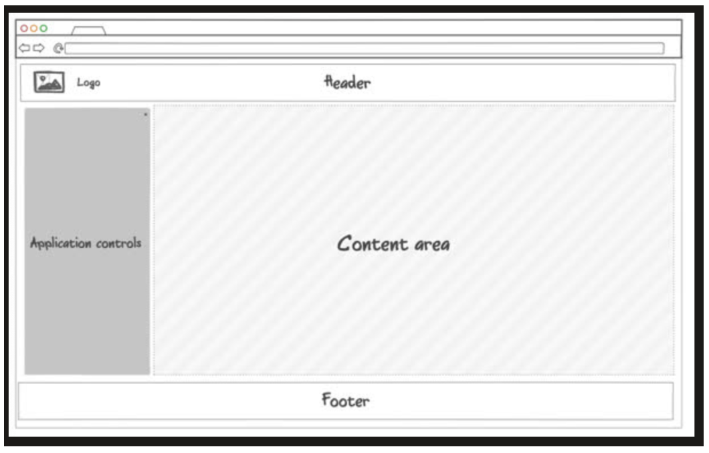

Media Query: Handle small screen size
@media (orientation: portrait) {
  main {
    flex-direction: column; //stack all items on top instead of side by side
  }
}

@media (max-height: 700px) {
  header {
    display: none; //drop header and footer if screen too small
  }
  footer {
    display: none;
  }
}

how to center text horizontal & vertical
flex: 1;
  display: flex;
  align-items: center; /* Center vertically */
  justify-content: center; /* Center horizontally */
  flex-direction: column; //display on top of each other

alter margin if two words on top of each other have some annoying space you want to overwrite
margin-top: 0; //NO space on top of word
margin-bottom: 0; //NO space below word

h2.login: The h2 element with the class=login
header h2: The h2 elements inside header (all descendants)

2/7: Debugging CSS, ☑ CSS frameworks, Simon CSS, ☑ Startup CSS
https://codepen.io/kgg511/pen/GReMQJM
Debugging CSS, 
open up in browser, inspect, and then look to see why
Styles pane shows CSS properties applied to selected element
align-items: center; centers the child elements vertically within the flex container.
justify-content: center; centers the child elements horizontally within the flex container.
Since text-align is more relevant for inline and inline-block elements, it may not have a noticeable effect on a flex container or its child elements

CSS frameworks 
Provide functions/components commonly used in web applications

Tailwind
instead of using rulesets, uses smaller definition that are applied to individual HTML elements. Moves CSS directly to html

Bootstrap
https://getbootstrap.com/docs/5.2/getting-started/introduction/#cdn-links

integrate Bootstrap by referencing Bootstrap CSS files from their CDN
add HTML link elements to head element like THIS:
<!DOCTYPE html>
<html lang="en">
  <head>
    <meta name="viewport" content="width=device-width, initial-scale=1" />
    <link
      href="https://cdn.jsdelivr.net/npm/bootstrap@5.2.3/dist/css/bootstrap.min.css"
      rel="stylesheet"
integrity="sha384-rbsA2VBKQhggwzxH7pPCaAqO46MgnOM80zW1RWuH61DGLwZJEdK2Kadq2F9CUG65"
    crossorigin="anonymous"
    />
  </head>
  <body>
    ...
  </body>
</html>

if use Bootstrap components that use javascript, include bootstrap JS module: Put this at the end of your HTML body element: 
<body>
  ...
  
</body>

later include NPM to get bootstrap by running this in console npm install bootstrap@5.2.3 **Update to newest version

Using Bootstrap
one linked in HTML files, we can use components
// Bootstrap styled button
<button type="button" class="btn btn-primary">Bootstrap</button>

// Default browser styled button
<button type="button">Plain</button>

2/9: The flip effect

    

        

            <!-- Front content goes here -->
        

        

            <!-- Back content goes here -->
        

    

https://unsplash.com/collections/2533969/food-

**2/9: JavaScript introduction, JavaScript Console, Adding JavaScript to HTML, Types, operators, conditionals, and loops, String**

JavaScript introduction, 
weakly typed language based on C, Java, Scheme
Not compiled
function join(a, b) {
  return a + ' ' + b;
}
console.log(join('Hello', 'world'));

JavaScript Console, 
console.log('hello %s', 'world');

specify CSS declarations to style log output
console.log('%c JavaScript Demo', 'font-size:1.5em; color:green;');
Timers: See how long a piece of code is running by wrapping in 
console.time('demo time');
// ... some code that takes a long time.
console.timeEnd('demo time');
// OUTPUT: demo time: 9762.74 ms
Count: See how many times a block of code is called
console.count('a');
// OUTPUT: a: 1
console.count('a');
// OUTPUT: a: 2

Adding JavaScript to HTML
either put js directly into script element or just use src attribute of script to reference JS file.
<head>
  
</head>
<body>
  <button onclick="sayHello()">Say Hello</button> //using function from 
  <button onclick="sayGoodbye()">Say Goodbye</button>
  
</body>

<button onclick="let i=1;i++;console.log(i)">press me</button>
//do this code when clicked

Types, operators, conditionals, and loops, 
let x = 1; //you can change the value of this variable
const y = 2; //you cannot change the value
**avoid keyword var

PRIMITIVES
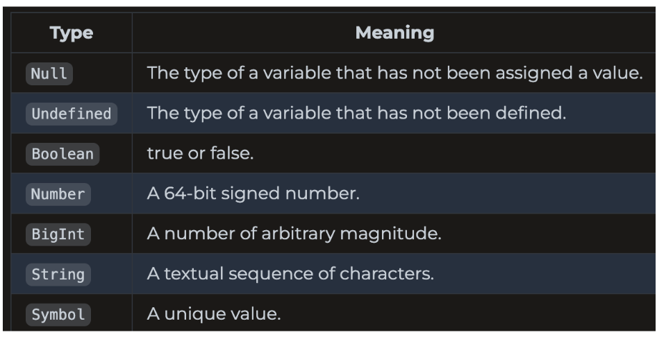
you don’t have to declare a variable before using it so it could have type undefined

Object Types
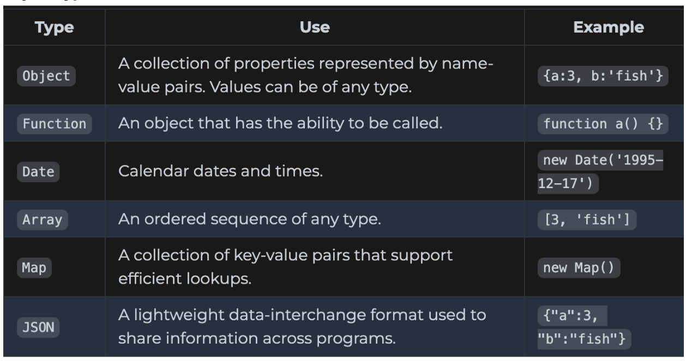

weakly typed. A variable always has a type but it can change when assigned to a new value. Or might be automatically converted
2 + ‘3’ = ‘23’ //addition makes it string
2 * ‘3’ = 6 //multiplication makes it number
[2] + [3] = ‘23’
true + null = 1
true + undefined = NaN

weird stuff with equality operator so JS has strict equality operators that do not do type conversion when converting equality
1 === ‘1’ is false, null ===undefined is false, ‘’ === false

Conditionals
if(){}
else if(){}
else{}

a === 1 ? console.log(1) : console.log('not 1');
|| ! &&
do{} while()
for(let i = 0…){}
while(){}
for(const name in obj){} //if obj is array it will be the index, dictionaries its keys
for(const val of arr){} //array values
break, continue

String
‘’ or “”
` mean string literal that may contain js that is evaluated and concatenated to string. Or create multiline strings
console.log(`string ${l + (1 + 1)} text`); //eval l+ (1=1) and concat with the rest of string

JS supports unicode. string is 16-bit unsigned integer

String functions
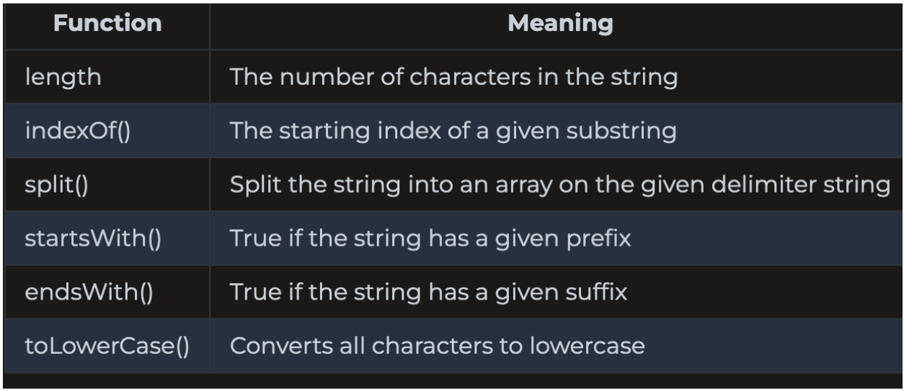
s.length(), s.split(‘:’)

2/12: Functions, Arrow functions, Arrays, JSON, Objects and classes

Functions
functions are objects -> can be given a name, passed as parameter, returned, or referenced from object/array
type inferred by assignment of value to parameter
If parameter not provided then the value of thee parameter is undefined when the function executes
function labeler(value, title = 'title') {
  console.log(`${title}=${value}`);
}
labeler(); // OUTPUT: title=undefined

labeler('fish'); // OUTPUT: title=fish
labeler('fish', 'animal'); // OUTPUT: animal=fish

Anonymous functions
console.log(
  doMath(function (a, b) {return a - b; },
    5,3));
const add = function (a, b) {return a + b;};

Inner functions: Declare functions inside other functions
function labeler(value) {
  function stringLabeler(value) {
    console.log('string=' + value);
  }
  if (typeof value == 'string') {
    stringLabeler(value);
}

Arrow functions
const a = [1, 2, 3, 4];
a.sort((v1, v2) => v1 - v2); //pass in function that takes two parameters and returns difference
return keyword is optional if no {} and it has only one expression. Automatically returns result of expression. However if {} are included then it behaves like regular function and need return
()=>{return 3;}

This pointer: Arrow function inherit this pointer from the scope of creation.
closure: function can continue referencing creation scope even after passed out of scope.
function makeClosure(a) {
  a = 'a2';
  const b = 'b2';
  return () => [a, b]; //this function remembers what a & b are from this scope
}

Example:
//when user scrolls, call debounce
window.addEventListener(
  'scroll',
  debounce(500, () => {
    console.log('Executed an expensive calculation');
  })
);

//if function call again before window times out it resets timeout
function debounce(windowMs, windowFunc) {
  let timeout;
  return function () {
    console.log('scroll event');
    clearTimeout(timeout);
    timeout = setTimeout(() => windowFunc(), windowMs);
  };
}

Arrays
const a = [1, 2, 3];
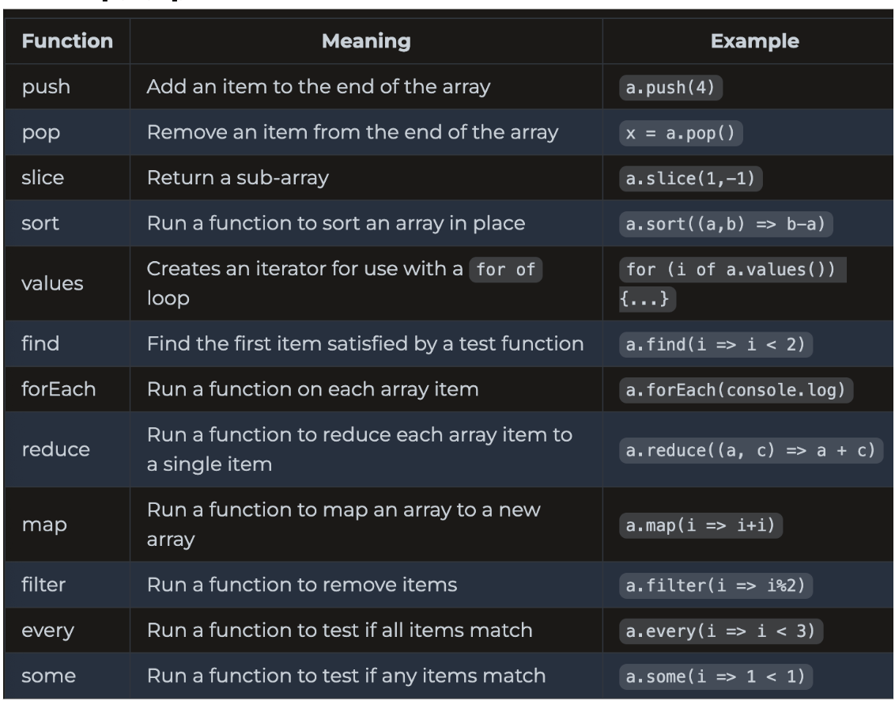

JSON
easily convertible to and from JS objects
JSON contains one of these types: string, number, boolean, array, object {“a”:”1”, “b”:”hi”}, null
JSON may have different data types within the same documents
Objects contains 0+ key value pairs. Key is always a string, value must be one of the JSON data types. {} for objects

Json Document Example
{
  "class": { //object with 2 key-value pairs
    "title": "web programming",
    "description": "Amazing"
  },
  "enrollment": ["Marco", "Jana", "فَاطِمَة"], //array w 3 elements
  "start": "2025-02-01", //string
  "end": null //null, indicates end date is unknown
}

Convert to JS
const obj = { a: 2, b: 'crockford', c: undefined }; //make object
const json = JSON.stringify(obj); //turn object into a json
const objFromJson = JSON.parse(json); //turn JSON back into object
To parse you are just passing a long string so it might contain multiple items not just one object

JS Objects and classes
JS object represents a bunch of name-value pairs called properties
property name must be String or Symbol, value can be any type

const obj = new Object({ a: 3 }); //create Object with one property
obj['b'] = 'fish'; //add another property
obj.c = [1, 2, 3]; //add another property
obj.hello = function () {
  console.log('hello');
};

The term ‘object’ can refer to standard JS objects like Promise/Map/Object/Function/Data,etc or JS Object object new Object() or a JS object you create.

Object-literals: Declare variable of object type like this also:
const obj = {
  a: 3,
  b: 'fish',
};

static Object functions:s
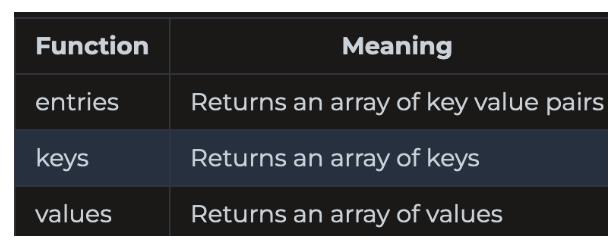
Object.entries(obj)

Constructor: Any function that returns an object is considered a constructor and can be involved with new
function Person(name) {
  return {
    name: name,
    log: function () {
      console.log('My name is ' + this.name);
    },
  };
}
const p = new Person('Eich');
p.log();

this pointer: Depends on the scope of its use, but here refers to a pointer to the object.
Classes: You can use classes to define object (reusable component). Have explicit constructor

class Person {
  constructor(name) {
   #name

    this.name = name; //not private
    this.#name = name; //makes the property private

  }
  log() {
    console.log('My name is ' + this.name);
  }
}

Inheritance: 
class Person {
  constructor(name) {
    this.name = name;
  }

  print() {
    return 'My name is ' + this.name;
  }
}

class Employee extends Person {
  constructor(name, position) {
    super(name);
    this.position = position;
  }

  print() {
    return super.print() + '. I am a ' + this.position;
  }
}

const e = new Employee('Eich', 'programmer');
console.log(e.print());

**2/14: Regular expressions, Rest and spread, Exceptions, Destructuring**

Regular expressions
create with class constructor of regex literal
const objRegex = new RegExp('ab*', 'i');
const literalRegex = /ab*/i;
the string class has functions that accept regex: match/replace/search/split
const petRegex = /(dog)|(cat)|(bird)/gim;
const text = 'Both cats and dogs are pets, but not rocks.';
text.match(petRegex); // RETURNS: ['cat', 'dog']

Rest and spread
Rest: Pass in as many parameters as you want. **only on last parameter
function hasNumber(test, ...numbers) {
  return numbers.some((i) => i === test);
}
hasNumber(2, 1, 2, 3);

Spread: The opposite of rest. Takes an iterable and expands it into a functions parameters
function person(firstName, lastName) {
  return { first: firstName, last: lastName };
}
const p = person(...['Ryan', 'Dahl']);

Exceptions
try {
  // normal execution code
} catch (err) {
  // exception handling code
} finally {
  // always called code
}
only throw exceptions in exceptional circumstances
Fallbacks: alternative thing to do when something isn’t available.

Destructuring
Descructuring: pulling individual items out of an existing one, removing structures. 
const a = [1, 2, 4, 5];
// destructure the first two items from a, into the new variables b and c
const [b, c] = a; //set b to the first item of a, c to the second item of a

const [b, c, ...others] = a; //1, 2, [4,5]

Destructuring objects: Specify the properties to pull.
const o = { a: 1, b: 'animals', c: ['fish', 'cats'] };
const { a, c } = o;

const o = { a: 1, b: 'animals', c: ['fish', 'cats'] };
const { a: count, b: type } = o; //pull out a & b but rename them

const { a, b = 22 } = {}; //trying to pull a & b from empty object. a will be undefined but b has a default value so it will be 22.
const [c = 44] = []; //try to take c from list oh not in there so just take default value.

[a] = [1, 2, 3]; //take 1st element from list and put it in a (a is not a list)

**2/16: Scope, Modules, Document object model (DOM), LocalStorage**
https://codepen.io/kgg511/pen/oNVdWLQ

Scope
4 Types of Scope
Global: visible to all
Module: visible to all code in module
Function: visible within function
Block: visible within {}

var ignores block scope. (don’t use var use let or const)
this: a variable that points to an object that contains the context within the scope of the currently executing line of code. You can reference anywhere in a program, so that value depends on context.
Global (outside function/object): runtime environment
Function (inside function): Refers to object that owns function (either object you defined or globalThis). In strict mode global function is undefined
Object (inside object): Refers to the object (ex: inside class)
// global scope
console.log('global:', this);
console.log('globalThis:', globalThis);

// function scope for a global function
function globalFunc() {
  console.log('globalFunctionThis:', this);
}
globalFunc();

// object scope
class ScopeTest {
  constructor() {
    console.log('objectThis:', this);
  }

  // function scope for an object function
  objectFunc() {
    console.log('objectFunctionThis:', this);
  }
}

Closure: Includes a function and its surrounding state. Whatever variables are accessible when are function is created are available inside the function even if you pass the function in a different scope.
However, in arrow functions they inherit the this pointer of the context in which they were CREATED (called). arrow functions do not have their own this context. They just capture this from the surrounding scope when the function is created.
globalThis.x = 'global';
const obj = {
  x: 'object',
  f: () => console.log(this.x), //created in the global context so has global this
//Arrow functions capture this at time of creation
};
obj.f();

if the function instead returns an arrow function then the this pointer is back to the objects this pointer. 
const obj = {
  x: 'object',
  make: function () { //created inside a function so it takes this from there which is obj
    return () => console.log(this.x);},
};
const f = obj.make();
f(); //function is called here
// OUTPUT: object

JS Modules
Node.js modules: CommonJS modules
JavaScript modules: ES modules

ES modules
file 1
export function alertDisplay(msg) { //export keyword so it can be imported elsewhere
  alert(msg);}

file2
import { alertDisplay } from './alert.js';
alertDisplay('called from main.js');

Modules can only be called from other modules. You can’t access JS in a module from global scope of non-module JS
ES Modules in browser:
index.html

To use module in the global scope that our HTML/non-module JS executes in, must leak into global scope. Either attach event handler or add function to global window object.
<html>
  <body>
    
    <button onclick="btnClick('button clicked')">Press me</button>
  </body>
</html>

if you use web framework bundler you don’t have to worry about differentiating global scope & ES scope.

☑ Document object model (DOM)
DOM: object representation of the HTML elements that the browser uses to render display
browser gives access to DOM through global variable document that points to root element of DOM
everything in HTML document gets a node in DOM. Form big tree with  node at top

Accessing DOM
All HTML elements use DOM element interface
interface provides ability to iterate over child elements, access parent, manip child
const listElements = document.querySelectorAll('p'); //select all p elements
for (const el of listElements) {  // Output the text content of each 
 element to the console
  console.log(el.textContent);
}

Modify DOM
create new element: create element, insert into tree by appending to existing element
function insertChild(parentSelector, text) {
  const newChild = document.createElement('div'); //create
  newChild.textContent = text;
  const parentElement = document.querySelector(parentSelector); //append
  parentElement.appendChild(newChild);
}
insertChild('#courses', 'new course');

delete:
const el = document.querySelector(elementSelector); 
  el.parentElement.removeChild(el); //we ask its parent to delete its child

Inject HTML
el.innerHTML = '
<b>Hello</b>!
';
→ HUGE hack risk, they can basically run whatever code that they want. So make sure that HTML cannot be manipulated. Don’t use .innerHTML, use DOM manipulation functions.

Event Listeners
All DOM elements can attach function that gets called when event occurs on element.
Clipboard(cut/copy/paste), focus, keyboard, mouse, text selection
const submitDataEl = document.querySelector('#submitData');
submitDataEl.addEventListener('click', function (event) {
  console.log(event.type);
});
add directly in HTML
​​<button onclick='alert("clicked")'>click me</button>

document.styleSheets[0].insertRule("#output table {border-collapse: collapse;}");
//insert a rule on a selector for all tables which is ‘border-collapse..’

LocalStorage
browser’s localStorage API allows you to persistently store/retrieve data across different pages.
it is also a cache for when data can’t be obtained from server

Main Functions
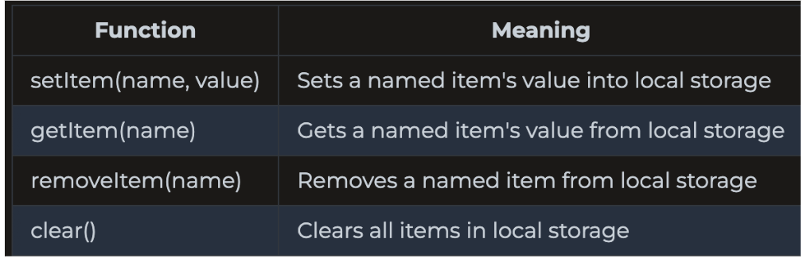
local storage value must be string/number/boolean. To store object convert to JSON string and just JSON.parse() when retrieve

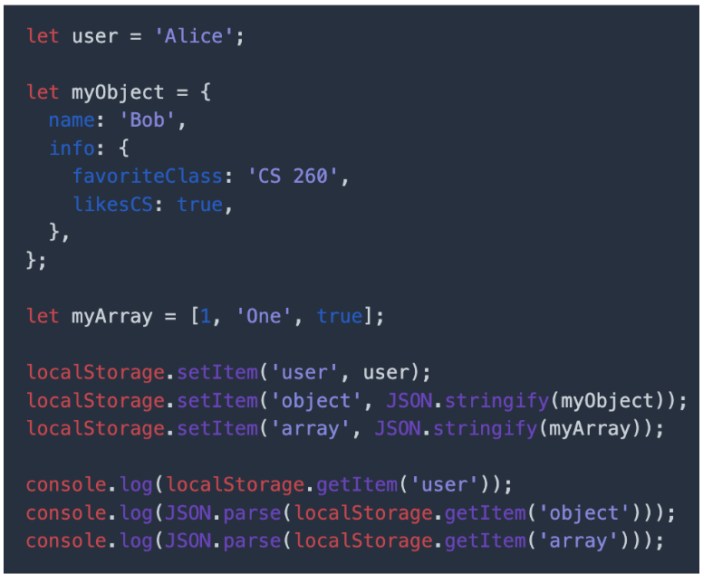

**2/20:☑ Promises, Async/await**
https://codepen.io/kgg511/pen/ExMLRqG

Promises
-JS is single threaded, meaning it only executes one piece of code at the same time
-Asynchronously execute code using Promise
Promise object States
-Pending: Running asynchronously
-Fulfilled: Successfully completed
-Rejected: Failed to complete

Create
new Promise(executor function that runs asynch op) //executor called automatically

EXAMPLE
const delay = (msg, wait) => {
  setTimeout(() => {
    console.log(msg, wait);
  }, 1000 * wait);
};

new Promise((resolve, reject) => {
  for (let i = 0; i < 3; i++) {
    delay('In promise', i); //calls this function 3 times in succession but schedule messages after delay
  }
});

for (let i = 0; i < 3; i++) {
  delay('After promise', i); //it must wait for each to finish before calling the next one
}

Resolve and Reject (setting state)
Promise executor function takes functions resolve & reject as parameters
calling resolve sets promise to fulfilled state, calling reject sets to rejected state

const coinToss = new Promise((resolve, reject) => {
  setTimeout(() => {
    if (Math.random() > 0.5) {
      resolve('success'); //if case happens change state to succcess
    } else {
      reject('error');
    }
  }, 10000);
});

coinToss //attach to the object
  .then((result) => console.log(`Coin toss result: ${result}`))
  .catch((err) => console.log(`Error: ${err}`))
  .finally(() => console.log('Toss completed'));

Then, catch, finally
promise object has three functions: then,catch,finally
then: called if promise fulfilled
catch: called if promise rejected
finally: called after all processing

Observer Pattern
Observers also do asyn processing. 
promises immediately begin to execute when created
observers form a pipeline that you pass an execution object into. Can be reused.

Modify the CodePen to include a new function that makes the pizza and include it in the promise chain.

MULTIPLE PROMISES
generally one catch at the end, but you can have many then
placeOrder(order)
    .then((order) => cookOrder(order)) //once place order, Cook the order
    .then((order) => serveOrder(order))
    .catch((order) => { //if at any point it fails call this
      orderFailure(order);
    });

 Async/await
https://codepen.io/kgg511/pen/XWGqBry
await requires the function it is awaiting to be async and to return a promise (manually resolve promise inside function with resolve())

more concise representation of promise
await: block until promise state moves to fulfilled or throw exception if rejected

Create equivalent executions with these 2 things

1.promise then/catch chain
coinToss()
  .then((result) => console.log(`Toss result ${result}`))
  .catch((err) => console.error(`Error: ${err}`))
  .finally(() => console.log(`Toss completed`));

2.using async/await
try {
  const result = await coinToss(); //wait until move to success/error
  console.log(`Toss result ${result}`); //success
} catch (err) {
  console.error(`Error: ${err}`); //reject
} finally {
  console.log(`Toss completed`); //finally
}

async
You cannot await unless it is called at the top level of JS OR it is in a function defined with async.
async declares a function that returns a promise. Turns function into async function that can make asynch requests
If you just put async in the def of a function it turns into a promise that is immediately resolved
If the async function returns a promise then it’s going to create a promise that is pending until somewhere else you do await function_name().
async function cow() {
  return new Promise((resolve) => {
    resolve('moo');
  });
}
console.log(cow());
// OUTPUT: Promise {<pending>}

await
await wraps a call ot the async function and blocks execution until the promise has resolved, which returns the result of the promise.
console.log(cow()); // OUTPUT: Promise {<pending>}
console.log(await cow()); //OUTPUT: moo

Together
application: call fetch web API on endpoint. 
two promises: network call, converting the result to JSOn
Promise implementation
const httpPromise = fetch('https://simon.cs260.click/api/user/me');
const jsonPromise = httpPromise.then((r) => r.json());
jsonPromise.then((j) => console.log(j));
console.log('done');

aync/await implementation
const httpResponse = await fetch('https://simon.cs260.click/api/user/me');
const jsonResponse = await httpResponse.json();
console.log(jsonResponse));
console.log('done');

**2/21: Debugging JavaScript, Simon JavaScript, Startup JavaScript**

Debugging JavaScript
console tab you can see print statements or run JS code there to see variable values
Sources: you can set breakpoints by clicking the numbers. Then just reload the page and it will stop there

**Midterm line**
--------------------------
**MIDTERM 2/26: The internet, Web servers, Domain names**
The internet
internet connects independent networks and computing devices
to talk to another a device must have an IP address. Domain names converted to IP
connect by asking for connection route to device
traceroute: determine hops in a connection
traceroute byu.edu
sending of data uses TCP/IP model
layers: 
Application layer: web user functionality
Transport: breaks into chunks and sends data
Internet: makes the connection. 
Link layer: physical connections and hardware

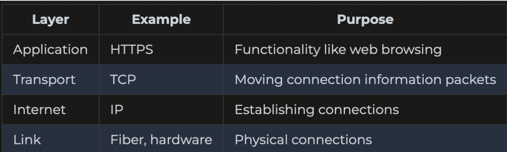
Web servers
web server hosts a web service that knows how to accept incoming internet connections and speak HTTP protocol

package main

import (
	"net/http"
)
func getTime(w http.ResponseWriter, r *http.Request) {
	io.WriteString(w, time.Now().String())
}
func main() {
	fs := http.FileServer(http.Dir("./public_html")) // Serve up files found in public_html
	http.Handle("/", fs)
	http.HandleFunc("/api/time", getTime) // Dynamically provide data
	http.ListenAndServe(":3000", nil) // Listen for HTTP requests
}
curl localhost:3000/api/time -> make HTTP request

web service gateways: 
each service on different port
service gateway listens on common HTTPs port 443, looks at request, and maps to services running on different ports. CADDY will be gateway
Microservices: web services that provide single functional purpose. For one microservice you may need to deploy 1000 instances of it to support 1 million users
Serverless: server removed and write function to speak HTTP
Domain names
get ip address for any domain using dig: dig amazon.com
broken into root domain, 1+ subdomain prefixes
react.simon.cs260.click //subdomain + root in bold
DNS: once domain name is in the registry it can be listed with DNS server and associated with IP address
DNS database records facilitate mapping names to IP addresses
A record: straight mapping from domain name to ip address
CNAME record: maps one domain name to another domain name

**2/28: Web Services Introduction, URL, Ports, HTTP,  Fetch**

Web Services Introduction
all web programming requests b/t devices use HTTPs to exchange data
make requests to external services to get external data. 
give URL of web service to fetch function built in browser
create web service: fetch requests to store data, security, tasks. web service is backend.
functions provided by web service are called endpoints
access web service endpoints via fetch function

can make requests to other web services.
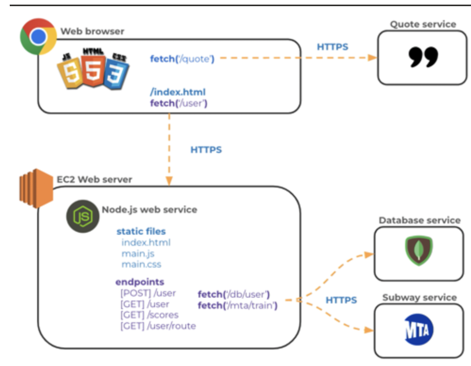
URL
location of web resource: web page, font, image, database record, JSON object ,etc
only required parts are scheme and domain name
<scheme>://<domain name>:<port>/<path>?<parameters>#<anchor>

Scheme: protocol required to ask for resource
Domain name: domain name that owns resource represented by URL: byu.edu
Port: network port used to connect to domain server: 3000
Path: path to resource on the domain. Does not have to be on file system with this path. 
Parameters: list of key value pairs. /school/byu/user/8014
filter=names&highlight=intro,summary
Anchor: sub-location in the resource. summary

URN: unique resource name that does not specify location information
URI: uniform resource identifier: URL/URN
web programming always uses URL

Ports
To connect to device you need IP address and port
port allows single device to support multiple protocols and different types of services
0-1023: standard protocols, 1024-49152: ports assigned to requesting entities, 49152-65535 create dynamic connections to a device.
when you built web server you externally exposed port 22 so you could use ssh to open remote console on server, port 443 for secure HTTP communication, port 80 for unsecure HTTP communication
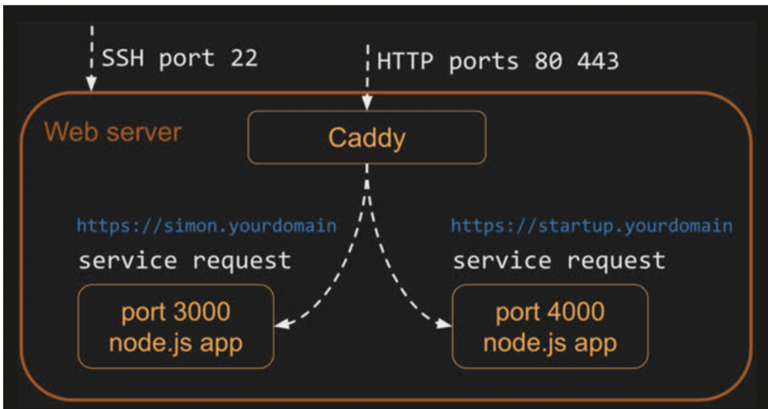
caddy is listening on 80 and 443
when get request on 80, redirect to port 443 to use secure connection
request on 443 -> examines path in HTTP request, if match static file, read file. If match def for gateway service, caddy makes connection on that service’s port and passes request
one port per service

HTTP
web client and server exchange http requests and responses
REQUEST
GET /hypertext/WWW/Helping.html HTTP/1.1
Host: info.cern.ch
Accept: text/html

<verb> <url path, parameters, anchor> <version>
[<header key: value>]*
[

  <body>
]
—-----------------------------
RESPONSE
<version> <status code> <status string>
[<header key: value>]*
[
  <body>
]
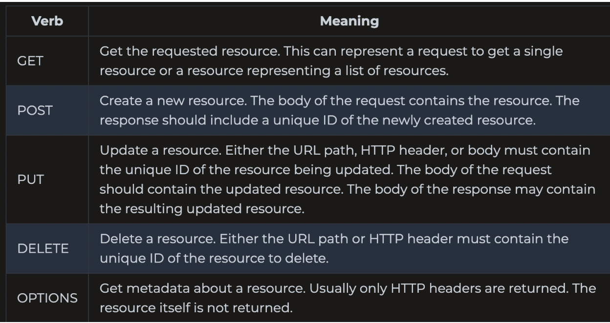
Status codes:
1xx: informational, 2xx: success, 3xx: redirect to another location, 4xx: client errors, 5xx: server errors
headers: specify metadata

body: format of body defined by Content-Type header
Cookies: 
an HTTP request knows nothing about previous/future request
method of tracking state. Generated by server and passed to client as HTTP header
HTTP/2 200
Set-Cookie: myAppCookie=tasty; SameSite=Strict; Secure; HttpOnly

Client caches and returns as HTTP header

HTTP/2 200
Cookie: myAppCookie=tasty

Fetch
fetch API is preferred way to make HTTP requests
takes in URL, returns a promise. then function takes callback function that is called when the requested URL content is  obtained. If returned content is of type json then json function on response object to convert to js
fetch request
fetch('https://api.quotable.io/random')
  .then((response) => response.json())
  .then((jsonResponse) => {
    console.log(jsonResponse);
  });
response
{
  content: 'Never put off till tomorrow what you can do today.',
  author: 'Thomas Jefferson',
};

POST request
fetch('https://jsonplaceholder.typicode.com/posts', {
  method: 'POST',
  body: JSON.stringify({
    title: 'test title',
    body: 'test body',
    userId: 1,
  }),
  headers: {
    'Content-type': 'application/json; charset=UTF-8',
  },
})
  .then((response) => response.json())
  .then((jsonResponse) => {
    console.log(jsonResponse);
  });

https://codepen.io/kgg511/pen/qBvgrmK

**3/1: Node.js**
Chromium browsers use V8. Node.js runs V8 engine inside console application. When run JS in Chrome/Node.js, V8 reads code and executes
install Node version manager and use to install Node.js into development environment.
node -v    → tells you what version of node you have. Use to verify it’s installed.
Execute line of JS with Node.js using -e
node -e "console.log(1+1)"
Running programs: write .js file. Then execute with: node filename.js
run in interpreter mode with just node

Node package manager
To load a package:initiailize code to use NPM. install page locally using NPM, then include require statement in code that references package names.
mkdir npmtest //directory for javascript
cd npmtest
npm init -y //initialize code to use NPM
many pre existing packages NPM website

Package.json
directory will contain file named package.json. Includes metadata about project, commands you can execute, packages project depends upon.
{
  "name": "npmtest",
  "version": "1.0.0",
  "description": "",
  "main": "index.js",
  "keywords": [],
  "author": "",
  "license": "ISC",
  "scripts": {
    "test": "echo \"Error: no test specified\" && exit 1"
  }
}

npm install give-me-a-joke //install package -> now in package 
"dependencies": {
    "give-me-a-joke": "^0.5.1"
  }

npm uninstall packageName //remove package dependency

NPM will create file called package-lock.json and directory node_modules. node_modules will get large, do not check into source control system, put node_modules in gitignore file
when clone github code, run npm install in project directory to install previously installed packages

Using the package
const giveMeAJoke = require('give-me-a-joke'); //reference package name as parameter to requi
giveMeAJoke.getRandomDadJoke((joke) => { //call its getRandomDadJoke function
  console.log(joke);
});

STEPS
Create your project directory
Initialize it for use with NPM by running npm init -y
Make sure .gitignore file contains node_modules
Install any desired packages with npm install <package name here>
Add require('<package name here>') to your application's JavaScript
Use the code the package provides in your JavaScript
Run your code with node index.js

**¾: ☑ Express, Simon service, ☑ Startup Service**
Express 
Node package Express provides support for:
Routing requests for service endpoints
Manipulating HTTP requests with JSON body content
Generating HTTP responses
Using middleware to add functionality

npm install express
const express = require('express');
const app = express(); 
app.listen(8080); //listen for HTTP requests on specified port

Defining Routes
app.get('/store/:storeName', (req, res, next) => { //route for HTTP GET for this path
  res.send({name: req.params.storeName}); //add parameter name with :
});
curl localhost:8080/store/orem

URL path matching pattern
callback function invoked when pattern matches
req: HTTP request object
res: HTTP response object
next: routing function that Express expects to be called if routing function wants another function to generate response.

// Pure regular expression
app.delete(/\/store\/(.+)/, (req, res) => res.send({delete: req.params[0]}));

using middleware
mediator: loads middleware and determine order of execution. Request comes to it, mediator passes to middleware components
Express has some middleware functions. routing functions are also middleware functions. HOWEVER, routing functions are only called in pattern matches, middleware functions are called for every HTTP request unless preceding middleware function doesn’t call next.
function middlewareName(req, res, next) //next middleware function
create your own middleware
app.use((req, res, next) => {
  console.log(req.originalUrl);
  next();
});

**order you add middleware to Express controls order that they are called in.
Built-in middleware: app.use(express.static('public'));
Third-party middleware: 
npm install cookie-parser
const cookieParser = require('cookie-parser');

app.use(cookieParser());

app.post('/cookie/:name/:value', (req, res, next) => {
  res.cookie(req.params.name, req.params.value); //add cookie function
  res.send({cookie: `${req.params.name}:${req.params.value}`});
});
app.get('/cookie', (req, res, next) => {
  res.send({cookie: req.cookies}); //add req.cookies object
});

error handling middleware
function errorMiddlewareName(err, req, res, next) //basic structure
app.use(function (err, req, res, next) { ///any error runs 
  res.status(500).send({type: err.name, message: err.message});
});

app.get('/error', (req, res, next) => { //add endpoint that generates an error
  throw new Error('Trouble in river city');
});

EXAMPLE WEB SERVICE BUILT USING EXPRESS

Simon service
EXAMPLE
endpoints for getting and updating scores
third party endpoints for inspirational quotes

Endpoint Definitions

GetScores: Get latest scores
curl -X GET /api/scores
#Response
{ "scores":[
  {"name":"Harvey", "score":"337", "date":"2022/11/20"},
  {"name":"도윤 이", "score":"95", "date":"2019/05/20"}
]}

SubmitScore: submit score for consideration
curl -X POST /api/score -d '{"name":"Harvey", "score":"337", "date":"2022/11/20"}'
#Response
{ "scores":[
  {"name":"Harvey", "score":"337", "date":"2022/11/20"},
  {"name":"도윤 이", "score":"95", "date":"2019/05/20"}
]}

Third Party endpoints
function displayQuote(data) {
  fetch('https://api.quotable.io/random')
    .then((response) => response.json())
    .then((data) => {
      const containerEl = document.querySelector('#quote');

      const quoteEl = document.createElement('p');
      quoteEl.classList.add('quote');
      const authorEl = document.createElement('p');
      authorEl.classList.add('author');

      quoteEl.textContent = data.content;
      authorEl.textContent = data.author;

      containerEl.appendChild(quoteEl);
      containerEl.appendChild(authorEl);
    });
}

Steps to convert simon to service
move .html, .js, favicon.io, .css to sub-directory public.  When running service the static file middleware reads frontend code from here and returns to browser.
app.use(express.static('public'));
inside project directory run npm init -y
.gitignore to ignore node_modules
install express via npm install express
create index.js in root of project. node.js calls this
add Express JS to host application static content
modify simon application code to make service endpoint requests to HTTP service code
async function loadScores() {
  const response = await fetch("/api/scores")
  const scores = await response.json()

debug node.js video
set up breakpoints in vscode
curl localhost:3000/api/user/test

**3/6: SOP and CORS, Service design**
SOP and CORS
SOP: Same origin policy: JS can only make requests to a domain if it is the same domain that the user is current viewing.
A request from hacker website to real website would fail
CORS: Cross Origin Resource Sharing: Allows the client to specify the origin of a request and then let the server respond with what origins are allowed.

Using third party services
to make requests to a different domain
HTTP/2 200
access-control-allow-origin: https://cs260.click //HTTP header explicitly list domain
h * or your calling origin else you can’t use them.
make sure services respond wit

Service design

GET, POST, PUT, and DELETE 

RPC (function call)
expose service endpoints as function calls
POST /updateOrder HTTP/2
{"id": 2197, "date": "20220505"}

OR
POST /rpc HTTP/2
{"cmd":"updateOrder", "params":{"id": 2197, "date": "20220505"}}
 
REST (resource)
PUT /order/2197 HTTP/2
{"date": "20220505"}

GraphQL *one endpoint, the query endpoint
manipulation of data instead of a function call/resource
specifies desired data and how it should be joined and filtered
with the query you can request for multiple things at once
query {
  getOrder(id: "2197") {
    orders(filter: {date: {allofterms: "20220505"}}) {
      store
      description
      orderedBy
    }
  }
}

Service Deliverable
For this deliverable I added backend endpoints that receive recipe makes, new recipe posts, and images.

Node.js/Express HTTP service: done
Static middleware for frontend: done
Calls to third party endpoints: On the login page it displays a random food image. (takes a second to show up, might have to return back to page later)
Backend service endpoints: Endpoints for uploading images to the server, deleting/adding/updating recipes and fetching recipes
Frontend calls service endpoints: The frontend calls the endpoints using fetch.

3/11: Development and production environments
development & production environments are kept separate using CI processes: checkout code, link, build, test, stage, then finally deploy to production environment
dev environment: your computer
production env: your server

./deployService.sh -k ~/prod.pem -h yourdomain.click -s simon
-k: credential file to access production env
-h: domain name of production env
-s: name of application being deployed

Deployment script
parse cmdline parameters
copy applicable source files into dist directory. dist is to be copied to production server
target directory on production env deleted for new one to replace
distribution directory copied to production env using scp
ssh to install node packages, restart service daemon that runs web application
clean development env by deleting distribution package

**3/13: Storage services, Data services**
Storage services
web applications often need to store files, this can be done using a database service
reasons to not store files directly on server: server has limited drive space, data will disappear when server disappears
AWS S3: unlimited capacity, only pay for what you use, global access, etc
STEPS (should you decide to use it)
create S3 bucket
get credentials so application can access bucket
use credentials
use SDK to write/list/read/delete files
Data services
https://cloud.mongodb.com/v2/65e55ac15965653a540ff80d#/metrics/replicaSet/65e55bec09f5b17de54b2062/explorer/rental/house/find

SQL has been great historically but there are DB that are better NoSQL solutions bc don’t use the general purpose relational db paradigms

Services & Specialities
MySQL: Relational queries
Redis: Memory cached objects
ElasticSearch: Ranked free text
MongoDB: JSON objects
DynamoDB: key value pairs
Neo4j: Graph based data
influxDB: Time series data

MongoDB
db made of 1+ collections that each contain JSON documents
collection: array of JS objects each with unique id
[
  {
    _id: '62300f5316f7f58839c811de',
    name: 'Lovely Loft',
    summary: 'A charming loft in Paris',
    beds: 1,
    last_review: {
      $date: '2022-03-15T04:06:17.766Z',
    },
    price: 3000,
  },
  {
    _id: '623010b97f1fed0a2df311f8',
    name: 'Infinite Views',
    summary: 'Modern home with infinite views from the infinity pool',
    property_type: 'House',
    beds: 5,
    price: 250,
  },
];

No strict schema requirements

EXAMPLE of DB:
db.house.find(); // find all houses
db.house.find({ beds: { $gte: 2 } }); // find houses with two or more bedrooms
db.house.find({ status: 'available', beds: { $lt: 3 } }); // find available houses with <3 beds
db.house.find({ $or: [(beds: { $lt: 3 }), (price: { $lt: 1000 })] }); // find houses with <3 beds OR <$1000/night 
db.house.find({ summary: /(modern|beach)/i }); // find houses with text 'modern'/ 'beach' in summary

Using MongoDB in application
install mongodb using NPM:
npm install mongodb

const { MongoClient } = require('mongodb');
const userName = 'holowaychuk';
const password = 'express';
const hostname = 'mongodb.com';
const url = `mongodb+srv://${userName}:${password}@${hostname}`;
const client = new MongoClient(url);

Now you can use this client to get a db object and from this a collection object for insert/query
if you insert a document into db/collection that doesn’t exist Mongo creates it automatically
when a document is inserted it automatically gets a random id

const collection = client.db('rental').collection('house'); //create collection object

const house = {
  name: 'Beachfront views',
  summary: 'From your bedroom to the beach, no shoes required',
  property_type: 'Condo',
  beds: 1,
};
await collection.insertOne(house); //insert document into db

const cursor = collection.find(); //query
const rentals = await cursor.toArray(); //find is asynch
rentals.forEach((i) => console.log(i));

If find is given no parameters it returns all documents in the collection
[ //example output
  {
    _id: new ObjectId('639a96398f8de594e198fc13'),
    name: 'Beachfront views',
    summary: 'From your bedroom to the beach, no shoes required',
    property_type: 'Condo',
    beds: 1,
  },
];

find() function:
const query = { property_type: 'Condo', beds: { $lt: 2 } };
const options = { //sort by descending price, first 10 documents
  sort: { price: -1 },
  limit: 10,
};
const cursor = collection.find(query, options);
const rentals = await cursor.toArray();
rentals.forEach((i) => console.log(i));

**3/18: Authorization services, Account creation and login, Simon Login, Startup Login
**Authorization services, 
ask for info like email/password, authenticate user by storing authentication token on the user’s device in a cookie passed back to web service on each request
allows service to associate data user gives with identifier of token
authorization services

Account creation and login
2 service endpoints: create authentication credential, authenticate/login on future visits
authentication endpoint: taken email & password and return cookie with authtoken and userID. If email DNE or bad password return 401 status code
POST /auth/create HTTP/2
Content-Type: application/json
{
  "email":"marta@id.com",
  "password":"toomanysecrets"
}

HTTP/2 200 OK
Content-Type: application/json
Set-Cookie: auth=tokenHere

{
  "id":"337"
}

GetMe endpoint: taken authToken, if token/user DNE return 401
GET /user/me HTTP/2
Cookie: auth=tokenHere

HTTP/2 200 OK
Content-Type: application/json
{
  "email":"marta@id.com"
}

Web service: 
const express = require('express');
const app = express();

app.post('/auth/create', async (req, res) => {
  res.send({ id: 'user@id.com' });
});

app.post('/auth/login', async (req, res) => {
  res.send({ id: 'user@id.com' });
});

const port = 8080;
app.listen(port, function () {
  console.log(`Listening on port ${port}`);
});

**a bunch of instructions to do all this stuff

function setAuthCookie(res, authToken) {
 res.cookie('token', authToken, {
   secure: true, //requires HTTPS to send cookie back to server
   httpOnly: true, //JS running on browser can’t read cookie
   sameSite: 'strict', //only return cookie to domain that generated it
 });
}

260 Login startup
database: replace dictionary with this
db1: The actual recipe info: username, recipe info…
then you can just get all of their recipes by selecting all rows with their username
db2: authToken, user. one username can have multiple authTokens

login: 
create: store user in the database and give them first authtoken. Verify that username is not already taken
login: verify username and password are correct, if so create an authToken and store.
cookies:
add create button to call create endpoint
creates an authToken associated w username???
- it puts the authToken in a header called a cookie
	- it will instead use authToken when fetching recipes. Well, an authToken -> username -> getRecipes

endpoints: create account, login, logout, get user, get recipes…
3/20:Service daemons - PM2, UI testing, Endpoint testing

Service daemons - PM2
keep programs running after closing computer by registering it as a daemon, PM2

ssh into server and see PM2 in command. pm2 ls
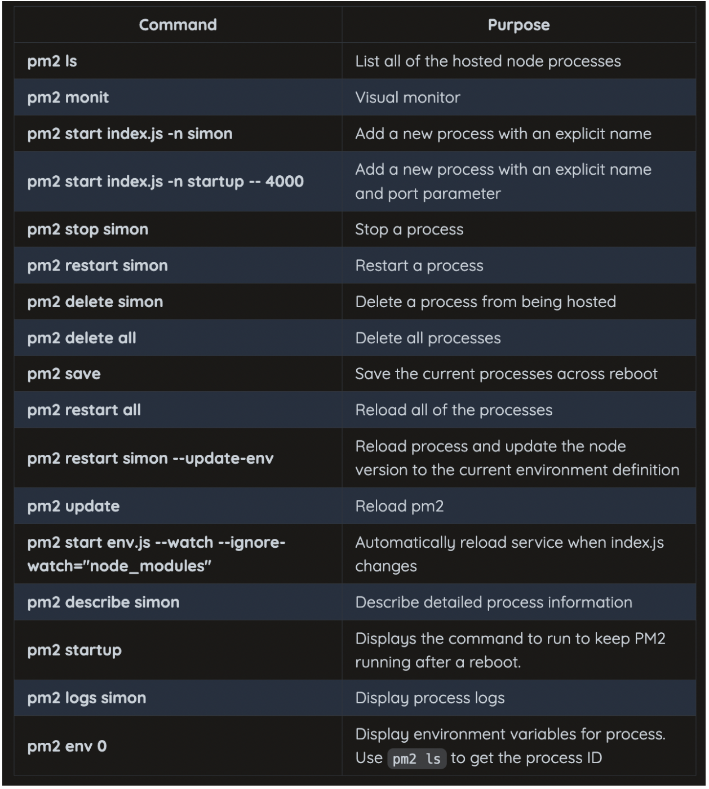

Register new web service (set up domain that accesses a different web service)
add rule to caddyfile to tell how to direct requests for that domain
create directory and add files for web service
configure PM2 to host web service

Modify caddy
ssh into server, copy startup one, change port.
when get request for domain pass to web service on specified port
tacos.cs260.click {
  reverse_proxy _ localhost:5000
  header Cache-Control none
  header -server
  header Access-Control-Allow-Origin *
}
restart caddy: sudo service caddy restart

create web service
cp -r ~/services/startup ~/services/tacos

UI testing
playright
npm init playwright@latest
import { test, expect } from '@playwright/test';

test('testWelcomeButton', async ({ page }) => {
  // Navigate to the welcome page
  await page.goto('http://localhost:5500/');

  // Get the target element and make sure it is in the correct starting state
  const hello = page.getByTestId('msg');
  await expect(hello).toHaveText('Hello world');

  // Press the button
  const changeBtn = page.getByRole('button', { name: 'change welcome' });
  await changeBtn.click();

  // Expect that the change happened correctly
  await expect(hello).toHaveText('I feel not welcomed');
});

VScode live server extension

BrowserStack

Endpoint testing
Jest for testing

console:
mkdir testJest
cd testJest
npm init -y
npm install express
code .

server.js
const express = require('express');
const app = express();

app.use(express.json());

// Endpoints
app.get('/store/:storeName', (req, res) => {
  res.send({ name: req.params.storeName });
});

app.put('/store/:storeName', (req, res) => {
  req.body.updated = true;
  res.send(req.body);
});

module.exports = app; //we export app object from server.js then import index.js to run server

index.js
const app = require('./server');

const port = 8080;
app.listen(port, function () {
  console.log(`Listening on port ${port}`);
});
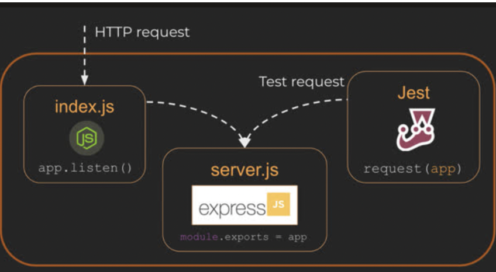
create file with suffix .test.js

store.test.js
test('that equal values are equal', () => {
  expect(false).toBe(true);
});

const request = require('supertest');
const app = require('./server');

test('getStore returns the desired store', (done) => {
  request(app)
    .get('/store/provo')
    .expect(200)
    .expect({ name: 'provo' })
    .end((err) => (err ? done(err) : done()));
});

npm install jest -D
replace scripts of package.json to:
"scripts": {
  "test": "jest"
},
npm run test

**3/22: WebSocket, Debugging WebSocket, WebSocket chat, Simon WebSocket, Startup WebSocket
**WebSocket
WebSocket is fully duplexed: After initial connection made to client, then upgraded by server to WebSocket connection, the relationship changes to peer-to-peer connection where either party can efficiently send data at any time
To have a convo between a group of users, the server is an intermediary: Each peer connects to server, server forwards messages 
Creating WebSocket convo: WebSocket API
CLIENT
const socket = new WebSocket('ws://localhost:9900'); 
socket.onmessage = (event) => { //register callback to receive messages
  console.log('received: ', event.data);
};
socket.send('I am listening'); //send messages w send function

server uses ws package to create WebSocketServer listening on same port of browser
SERVER
const { WebSocketServer } = require('ws');
const wss = new WebSocketServer({ port: 9900 });
wss.on('connection', (ws) => {
  ws.on('message', (data) => {
    const msg = String.fromCharCode(...data);
    console.log('received: %s', msg);

    ws.send(`I heard you say "${msg}"`);
  });

  ws.send('Hello webSocket');
});
Debugging WebSocket
refer back to when doing startup bc no worko
WebSocket chat
use ws for http, wss for https

web service
const { WebSocketServer } = require('ws');
const express = require('express');
const app = express();

// Serve up our webSocket client HTML
app.use(express.static('./public'));

const port = process.argv.length > 2 ? process.argv[2] : 3000;
server = app.listen(port, () => {
  console.log(`Listening on ${port}`);
});

const wss = new WebSocketServer({ noServer: true });

// Handle the protocol upgrade from HTTP to WebSocket
server.on('upgrade', (request, socket, head) => {
  wss.handleUpgrade(request, socket, head, function done(ws) {
    wss.emit('connection', ws, request);
  });
});
connection, message, and close events to forward messages between peers
let connections = [];

wss.on('connection', (ws) => {
  const connection = { id: connections.length + 1, alive: true, ws: ws };
  connections.push(connection);

  // Forward messages to everyone except the sender
  ws.on('message', function message(data) {
    connections.forEach((c) => {
      if (c.id !== connection.id) {
        c.ws.send(data);
      }
    });
  });

  // Remove the closed connection so we don't try to forward anymore
  ws.on('close', () => {
    connections.findIndex((o, i) => {
      if (o.id === connection.id) {
        connections.splice(i, 1);
        return true;
      }
    });
  });
});

automatically closes if no data is sent to it. You can have it send a ping message to see if user is there and receive pong to indicate yes.
setInterval(() => {
  connections.forEach((c) => {
    // Kill any connection that didn't respond to the ping last time
    if (!c.alive) {
      c.ws.terminate(); //terminate connections that don’t respond to ping
    } else {
      c.alive = false;
      c.ws.ping();
    }
  });
}, 10000);

//client side
ws.on('pong', () => {
  connection.alive = true;
});

Simon WebSocket
install ws 
attach websocket listener to HTTP server
Startup WebSocket

WebSocket Deliverable
For this deliverable I used webSocket to update the ‘makes’ on the recipes in realtime.
-Backend listens for WebSocket connection - done!
-Frontend makes WebSocket connection - done!
-Data sent over WebSocket connection - done!
-WebSocket data displayed - All recipe ‘makes’ display in real time.

**3/25: Security, OWASP top 10**

Security
sudo less +G /var/log/auth.log

-Hacking: process of making system do something it’s not supposed to
-Exploit: code or input that takes advantage of programming/configuration flaw
-Attack Vector: Method hacker employs to penetrate and exploit a system
-Attack Surface: Exposed parts of a system that an attacker can access: server endpoints, open port 22,443,80, user accounts
-Attack payload: The code/data that hacker delivers to system to exploit it
-Input sanitization: ‘cleaning’ input of potentially malicious data
-Black box testing: testing application without knowledge of internals of application
-White box testing: testing application with knowledge of source code and internal structure
-penetration testing: attempting to gain access to/exploit system
-mitigation: action taken to remove/reduce threat

Motivations to attack
-Disruption: destroy normal business operations
-Data exfiltration: by extract/expose data can embarrass company, exploit info, sell info, etc
-Resource consumption: if take control of computing resources can use it for other purposes.

Hacking Techniques
-Injection: turn user input into search query
-Cross-site scripting XSS: make malicious code execute on a different user’s browser. Turn a trustworthy browser into one that can steal passwords.
-Denial of service: attack with goal to make service inaccessible
-Credential Stuffing: steal credentials from previous attack and use on a different website. Or, brute force.
-Social engineering: Appeal to human desire to help to gain unauthorized access or info

What to do
-Sanitize input data: input data should not be able to be turned into executable or overload resources
-Logging: Log requests that will expose when system is exploited
-Traps: Create ‘valuable info’ and trigger alarms when data accessed
-Eucate
-Reduce Attack surfaces: Do not open access anymore than necessary for application
-Layered security: Multiple layers of security
-Least required access policy: Only give user the access they need
-safeguard credentials: do not store credentials in accessible locations
-public review

OWASP top 10
top 10 list of most important web application security risks
Broken Access Control: Doesn’t properly enforce permissions on user. Even if UI restricts it they could just change the URL
Cryptographic Failures: sensitive data accessible without encryption, weak encryption, etc
Injection: 
`p@ssword!'; DROP TABLE db; --`;
`SELECT user FROM db WHERE password='${password}' LIMIT 1`;
SELECT user FROM db WHERE password='p@ssword!'; DROP TABLE db; -- ` LIMIT 1
Insecure design: designed badly. EX: can create trial accounts easy -> make millions of accounts
Security Misconfiguration: 
Vulnerable and Outdated Components
Identification and Authentication Failures: Scenario where user’s identity can be impersonated by attacker. Guessing password, easy password recovery
Software and Data Integrity Failure: Attacks that allow external software, to compromise your application. Do security audit before using packages
Security Logging and Monitoring Failures: Store logs to be accessible, immutable so that hackers can’t just delete them
Server Side Request Forgery: Attack that causes service to make unintended internal requests to expose internal data or services

**3/29: Web frameworks, React, ☑ Components**
Codepen: https://codepen.io/kgg511/pen/zYXoePr
 Web frameworks, 
provide tools for common application task
React creates hybrid file format with html + JS

Vue framework: HTML, CSS, JS
template: html
script: js
style: css
Svelte: combines all 3. Requires transpiler.
React: JS + HTML. CSS is declared outside of JSX
import 'hello.css';

const Hello = () => {
  let name = 'world';
  return 
Hello {name}
;
};

p {
  color: green;
}

Angular component: defines what JS, HTML, and CSS combined together. Keeps JS, HTML, CSS separate

React, ☑ 
abstracts HTML into JS variant called JSX
JSX is converted into valid HTML and JS using preprocessor Babel
REACT
const i = 3;
const list = (
  <ol class='big'>
    <li>Item {i}</li>
    <li>Item {3 + i}</li>
  </ol>
);

converts to JS
const i = 3;
const list = React.createElement(
  'ol',
  { class: 'big' },
  React.createElement('li', null, 'Item ', i),
  React.createElement('li', null, 'Item ', 3 + i)
);
React.createElement generates the DOM elements. When change in data they represent changes, React triggers dependent changes 

Components
-react allows you to modularize application so that code directly represents the components the user interacts with
-render function: whatever is returned from this function is inserted into component HTML element

JSX

  Component: <Demo /> //this causes react to load Demo component, call render, insert here

React component
function Demo() { //render function
  const who = 'world';
  return <b>Hello {who}</b>;
}

Creates Resulting HTML

Component: <b>Hello world</b>

-Properties: pass info to components as element properties

JSX

Component: <Demo who="Walke" />

Component
function Demo(props) {
  return <b>Hello {props.who}</b>;}

RESULT

Component: <b>Hello Walke</b>

-State: Component can have internal state. state created by calling React.useState function. Returns variable containing current state and function to update state.
EX: create state variable, clicked, toggles click state in updateClicked function

const Clicker = () => { //creates component named Clicker
  const [clicked, updateClicked] = React.useState(false); 
//declare state variable clicked and initialize to false

  const onClicked = (e) => { //takes in event e. When called, toggles clicked
    updateClicked(!clicked);
  };

  return 
 onClicked(e)}>clicked: {`${clicked}`}
;
};

const root = ReactDOM.createRoot(document.getElementById('root'));
root.render(<Clicker />);

-You can use JSX without a function, just anywhere you would otherwise give component
const hello = 
Hello
;
ReactDOM.render(hello, document.getElementById('root'));

-Class style components: Don’t use these bc they are getting old but you should be able to read them. Properties on loaded on the constructor and state is set using setState function

class Clicker extends React.Component {
  constructor(props) {
    super(props);
    this.state = {
      clicked: false,
    };
  }
  onClicked() {
    this.setState({
      clicked: !this.state.clicked,
    });
  }
  render() {
    return 
 this.onClicked(e)}>clicked: {`${this.state.clicked}`}
;
  }
}

const root = ReactDOM.createRoot(document.getElementById('root'));
root.render(<Clicker />);

-Reactivity: A component’s properties and state are used by React framework to determine the reactivity of the interface. Reactivity controls how a component reacts to user actions or events. When state/properties change, the render function for the component and all of its dependent component render functions are called.

const Demo = ({ who }) //these two lines are the same
const Demo = (props.who) 

**4/1 Toolchain, ☑ Vite, ☑ Router**
 Toolchains
-code repository: stores code in shared, versioned,location
-linter: removes, or warns, of non-idiomatic code usage
-prettier: Format code according to shared standard
-Transpiler: compiles code into different format
-Polyfill: Generates backward compatible code to support old browser versions that do not support latest standards
-Bundler: packages code into bundles to deliver to browser
-Minifier:  Removes whitespace and rename variables to make code smaller and more efficient to deploy
-Testing: automated tests at multiple levels
-Deployment: automated packaging and delivery of code

-for React we use Github as repository, Vite for JSX, TS, dev and debugging support, ESBuild, Rollup for bundling, PostCSS for CSS transpile, deployReact.sh for deploy
☑ Vite
-Vite bundles your code quickly, has great debugging support, and allows you to easily support JSX, TypeScript, and different CSS flavors

-create new web application in the demoVite directory, download 3rd party packages, start up application on HTTP debugging server
-o to open browser to where it is, h to see all options
npm create vite@latest demoVite -- --template react
cd demoVite
npm install
npm run dev

Generated project directory
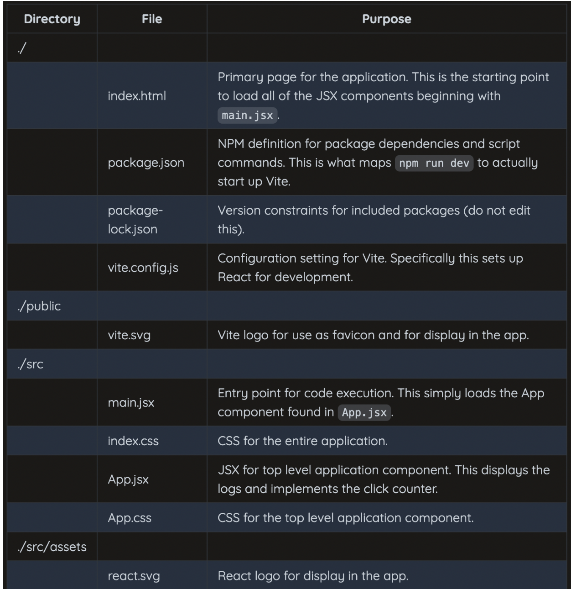
-The index.html is loaded, which tells it to load jsx in the html
-while in the jsx it saids load the app component in App.jsx

-use jsx for files with JSX
-Building production release: npm run dev bundles the code to a temp directory that Vite debug HTTP server loads from. To bundle application to deploy to production env, do npm run build
-npm run build: executes build script in package.json, invokes Vite. Outputs everything to deploy ready version contains in subdirectory named dist

-deployReact.sh creates production distribution by calling npm run build and then copying dist to production server

Alter the CSS to change background and text colors to something different.
Replace the text in the App component with your name.
Change the counter to increment by 10 instead of by one.

☑ Router
codepen: https://codepen.io/kgg511/pen/yLrVwye
-A web framework router provides functionality for single-page applications
-if you have multiple pages then the headers/footers/nav/common components must either be duplicated in each HTML page or injected before the server sends the page to the browser
-we use react-router-dom
// Inject the router into the application root DOM element
const root = ReactDOM.createRoot(document.getElementById('root'));
root.render(
  // BrowserRouter component that controls what is rendered
  // NavLink component captures user navigation requests
  // Routes component defines what component is routed to
  <BrowserRouter>
    

      <nav>
        <NavLink to='/'>Home</Link>
        <NavLink to='/about'>About</Link>
        <NavLink to='/users'>Users</Link>
      </nav>

      <main>
        <Routes>
          <Route path='/' element={<Home />} exact />
          <Route path='/about' element={<About />} />
          <Route path='/users' element={<Users />} />
          <Route path='*' element={<Navigate to='/' replace />} />
        </Routes>
      </main>
    

  </BrowserRouter>
);

**4/3:  Reactivity, ☑ Tic-tac-toe tutorial, Hooks**
Reactivity: https://codepen.io/kgg511/pen/jORVJMb
-React enables reactivity with props, state, and render
-when a component’s JSX is rendered, React parses the JSX, creates a list of any references to the component’s state or prop objects. Then, react monitors to see if any change. If so, call the render function.

// The Survey component
const Survey = () => {
  const [color, updateColor] = React.useState('#737AB0');

  // When the color changes update the state
  const onChange = (e) => {
    updateColor(e.target.value);
  };
  return (
    

      <h1>Survey</h1>
      {/* Pass the Survey color state as a property to the Question.
          When the color changes the Question property will also be updated and rendered. */}
      <Question color={color} />

      

        Pick a color: 
        {/* Pass the Survey color state as a property to the input element.
            When the color changes, the input property will also be updated and rendered. */}
        <input type='color' onChange={(e) => onChange(e)} value={color} />
      

    

  );
};

// The Question component
const Question = ({ color }) => {
  const [answer, updateAnswer] = React.useState('pending...');

  function onChange({ target }) {
    updateAnswer(target.value);
  }

  return (
    

      Do you like this
      {/* Color rerendered whenever the property changes */}
       color?
      <label>
        <input type='radio' name='answer' value='yes' onChange={(e) => onChange(e)} />
        Yes
      </label>
      <label>
        <input type='radio' name='answer' value='no' onChange={(e) => onChange(e)} />
        No
      </label>
      {/* Answer rerendered whenever the state changes */}
      
Your answer: {answer}

    

  );
};

ReactDOM.render(<Survey />, document.getElementById('root'));

☑ Tic-tac-toe tutorial
Hooks
used to make style components be able to do everything that a class style component can do. Also, as new features are added to React they are included as hooks
function Clicker({initialCount}) {
  const [count, updateCount] = React.useState(initialCount);
  return 
 updateCount(count + 1)}>Click count: {count}
;
}

ReactDOM.render(<Clicker initialCount={3} />, document.getElementById('root'));

-useEffect hook: represent lifecycle events: ex: every time component renders.
No dependencies in this example. Effect will be triggered on every render.
function UseEffectHookDemo() {
  React.useEffect(() => {
    console.log('rendered');
  });
  return 
useEffectExample
;
}

ReactDOM.render(<UseEffectHookDemo />, document.getElementById('root'));

-Control what triggers useEffect by specifying dependencies:
count1 is dependency. So, effect is only triggered when count1 changes
function UseEffectHookDemo() {
  const [count1, updateCount1] = React.useState(0);
  const [count2, updateCount2] = React.useState(0);

//use effect takes 2 arguments. function & optional dependency array
  React.useEffect(() => {
    console.log(`count1 effect triggered ${count1}`);
  }, [count1]);

  return (
    <ol>
      <li onClick={() => updateCount1(count1 + 1)}>Item 1 - {count1}</li>
      <li onClick={() => updateCount2(count2 + 1)}>Item 2 - {count2}</li>
    </ol>
  );
}

ReactDOM.render(<UseEffectHookDemo />, document.getElementById('root'));

**4/8: TypeScript, Performance monitoring**
TypeScript
-adds type checking to javascript. Will give you an error before code runs.
function increment(value: number) {
  return value + 1;
}
-you could use it to specify types of object properties
state: {
    imageUrl: string;
    quote: string;
    price: number;
  };

-Interfaces: collection of parameters and types an object must contain to satisfy that type.
interface Book {
  title: string;
  id: number;
}
-typescript could warn of variable possibly being null
-querySelector<HTMLElement>() : coerced subtype?
-unions: 
-define possible values for a type
type AuthState = 'unknown' | 'authenticated' | 'unauthenticated';
let auth: AuthState = 'authenticated';
	-define possible types variable can be:
function square(n: number | string) {
  if (typeof n === 'string') {
    console.log(`{$n}^2`);
  } else {
    console.log(n * n);
  }
}

https://www.typescriptlang.org/play

npx create-react-app my-app --template typescript
-create tsconfig.json to configure

Performance monitoring
-need to keep program loading fast or users will lose interest
-monitor browser application latency, network latency, service endpoint latency

Browser Application Latency
-impacted by speed of user’s device, amount of data, time complexity of algorithm
-make application processing as asynchronous as possible
-use compression when transferring files over HTTP, reduce quality of images/video, minify J/CSS, use HTTP/2or3

Network Latency
-avoid unnecessary/large network requests
-impacted by amount of data sent, amount user can receive/s, distance
-host application files in data centers close to the users you wish to serve

Service Endpoint Latency
-number of requests made and amount of time to process each
-reduce as much as possible

TOOLS
-Chrome network tab: see network request made and time, see which take most time/size
-network, you can simulate 3g low-end phone throttling
-chrome lighthouse: run analysis of application
-chrome performance tab
-global speed tests: test application from different locations around the world

**4/10: UX design**
-simplicity: attracts users attention and engages them. Not necessarily a blank page, just keep things focused on 1 purpose
-consistency: follow standard layout to other web pages so user doesn’t have to think too much
-navigation: 
-Application map: make map of all views to present to user
-Device controls: add navigational controls to use application
-Breadcrumb: where user is, form, to
-common actions
-colors: pick 1 primary, 1 secondary, 1 focus
-typography
-Iconography
-Text
-Limit line length. Specify max width 60-80 characters via max-width
-Internationalization: select desired language, different date formats, right-to-left
-space
-Interaction
-images
-Animation
-Decision fatigue: limit number of choices given at any time
-Device aware
-Device size and orientation
-Performance: consistently monitor loading speeds
-Short circuit: have alternative for when something isn’t working like a 3rd party call
-Accessibility: account for visual/audio/physical impairment
-legal:
	hipaa: individual chooses access/sharing of records
	ferpa: how student data can be shared/stored
	ada: 
	gdrr: applications must get approval from user before data is stored/shared
-walls: remove if possible
-complexity
-payment: move paywall so that user can see the value you offer before they hit it
-application failure: apologize to the user
-security: if too much user leaves if too little might leave

KAHOOT STUFF

1. port 80 for HTTP
2. HTTP status codes in 300 range are for content redirects or caching
3. Language is not a standard http header, but content-type, host and cookie are.
4. cookies allow a server to store data on the client
5. paul george john for get /fav/geore

6. which express middleware will match fetch request
app.delete(/fav\/(.*)/, () => {})

7. MongoDB query mathces: { name: "Walke", score: -55 }
8. Hashing stored passwords is important bc It improves security by making the password unreadable
9. console.log prints Client:Server:Hello
10. what value does WS add to HTTP: It is peer to peer instead of client to server
11. Purpose of JSX: render HTML from JS, componentize HTML, alow composability of HTML. NOT combine CSS/HTML/JS
12. tacofish
13. /burger renders B
14. NPM install ws DOES: Locks the version of the websocket package for your application, Adds the websocket source code to the node_modules directory, Adds a dependency to your package.json file. NOT Adds template code for websockets to your JavaScript
15. You can use fetch in front-end and back-end code
16. Linux Daemon: Executes independent of a user, Starts when the computer is rebooted, PM2 is an example of a daemon. It can fork other processes

