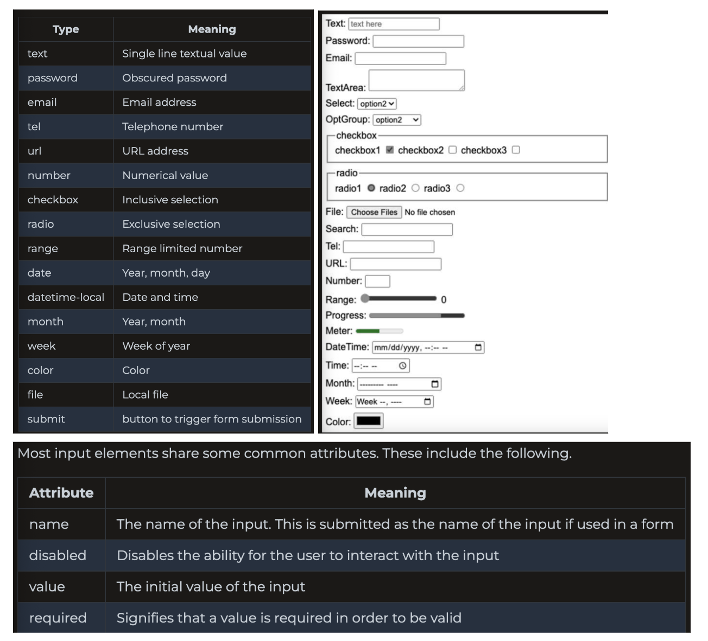
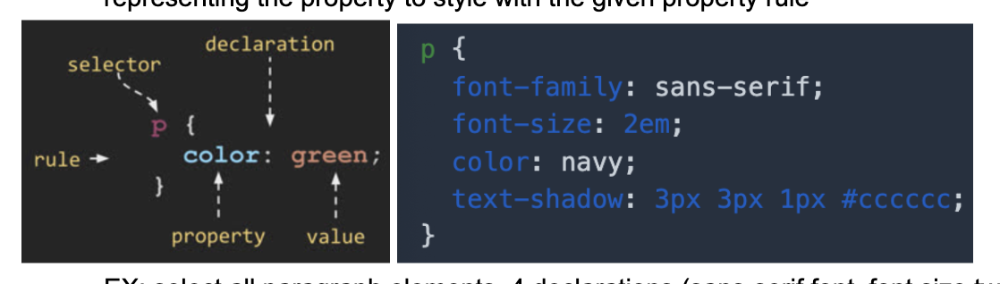
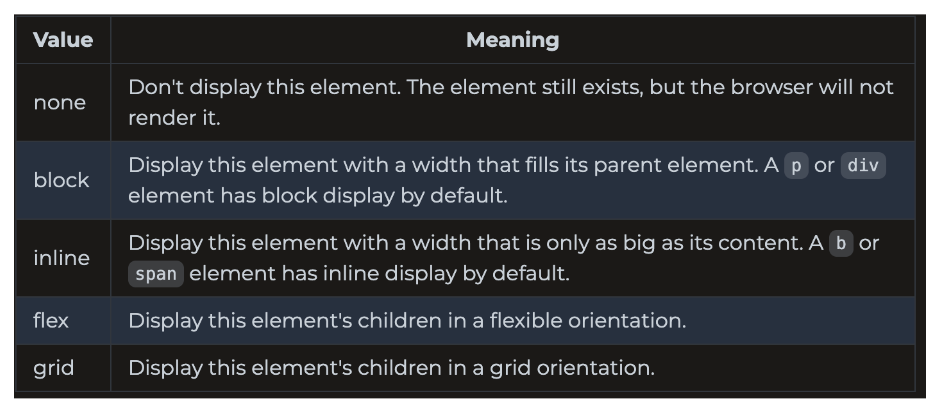
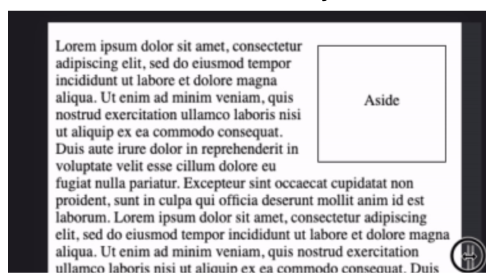

1/10/2024: code repositories

ls -la
show hidden directories. Use to see .git

-git checkout to go back to a previous version
-you can edit/commit changes directly from github
-git fetch: see latest info about changes on git
-git status: see the differences b/t clone and see if we’re missing a commit. 
Also tells us if we added stuff but haven’t yet committed.
-git -am “message” : Adds all new files and then commits with the message

print “more text” >> hello.txt means concatenate to the file
print “more text” > hello.txt means overwrite
git diff HEAD HEAD~1 //compare version with previous version
git log
Merge Conflicts

Configure your own commands:
git config --global -l
alias.s=status
alias.l=log --all --graph --decorate --oneline --pretty=format:'%C(bold 
red)%d%Creset %cr %C(bold yellow)%h%Creset - %C(green)%an%Creset %s'
pull.rebase=true
core.editor=code

-readme.md: Use to describe modifications and alterations you make to 
startup.
-notes.md: track what you have learned. will be used for the midterm/final

Fork: Create a copy of a github repository. Maintains a link to the original 
repository so you can pull down updates.

**1/19: EC2**
http://52.87.41.204/
ssh -i cs260/[filename] ubuntu@52.87.41.204
ssh -i cs260/[filename] ubuntu@tastetrove.click

**1/22: Caddy, HTTPS, TLS, and certificates**
Caddy
web service that listens for HTTP requests. Once received, it either gives the requested static files or routes the files to another web service (gateway/reverse proxy)
creation/rotation of web certificates
serves all static HTML/CSS/JS

FILES
Configuration file: ~/Caddyfile: for routing HTTP requests, determine location of HTML files,etc. Don’t change.
HTML files: ~/public_html: directory of files that Caddy servers up when requests are made
ex: request http://yourdomainname/index.html looks for index.html in public_html

HTTPS, TLS, and web certificates
HTTPS: HTTP with negotiated secure connection that happens before data is exchanged. All data encrypted w TLS protocol (negotiate shared secret and use to encrypt)
negotiation includes exchange of web certificate that identifies the dns of the server creating the server connection. Browser makes sure that certificate name matches domain name in URL.

Web Certificates
generated by 3rd party using private key encryption
once you have certificate for domain name, browser can validate
Let’s encrypt lets you make a web certificate for free.
Caddy: uses lets encrypt to generate a web certificate every time a HTTPS request is made for a domain that Caddy doesn’t have a certificate for. It then asks lets encrypt to verify that the domain is owned by the requester

curl -v -s https://byu.edu > /dev/null //see the negotiation that happens

EDIT Caddy configuration:
cd ~
vi Caddyfile
i //then make changes
esc
:wq + enter
sudo service caddy restart

**1/24: The Console, editors**
pwd: tells you what directory you are in
ls -la: see all files including hidden ones
echo - Output the parameters of the command
cd - Change directory
mkdir - Make directory
rmdir - Remove directory
rm - Remove file(s)
mv - Move file(s)
cp - Copy files
ls - List files
curl - Command line client URL browser
grep - Regular expression search
find - Find files
top - View running processes with CPU and memory usage
df - View disk statistics
cat - Output the contents of a file
less - Interactively output the contents of a file
wc - Count the words in a file
ps - View the currently running processes
kill - Kill a currently running process
sudo - Execute a command as a super user (admin)
ssh - Create a secure shell on a remote computer
scp - Securely copy files to a remote computer
history - Show the history of commands
ping - Check if a website is up
tracert - Trace the connections to a website
dig - Show the DNS information for a domain
man - Look up a command in the manual

|: Take output from command on left and pass as input to command on right
>: redirect output to file, overwrite file if exists
>>: redirect output to file, append to if exists.

Editors
VScode: editor for daily coding 
VI: when you are shelled into your production environment and need a simple, but powerful, console based editor for quickly editing text files.

VI
To use: change directory to one with some code to edit.
vi index.html
command mode: default. 
To edit, type i to enter insert mode,
esc to escape,  :w to save, :q to quit
https://vim.rtorr.com/

VIM commands
:h -> help
i -> insert mode. Use ESC to exit
u -> undo
ctrl-r -> redo
gg -> go to beginning of file
G -> go to end of file
/ -> search for patterns
n -> next search match
N -> previous search match
v -> visually select text
y -> yank/copy selected text to clipboard
p -> past clipboard
ctrl -wv -> split window vertically
crl -ww -> toggle windows
ctrl -wq -> close current window
:e -> open file
:w -> write file (save)
:q -> quit, :q! to not save

**1/26: codePen, HTML intro, structure, input, media**
CodePen: immediately renders code in preview window

To submit assignments that use codpen
create new pen or fork existing example
do stuff, saving occasionally
submit pen URL in canvas w something you learned

HTML introduction    MDN HTML
Text is valid in html. HTML is mostly about structure
elements have open/close tags
each HTML element has attributes
class: designates the element as classified into name group of elements

Hello world

hyperlink: anchor a with attribute href
<a href="https://byu.edu">Go to the Y</a>

doctype at the top to tell browser the type and version of the document
<!DOCTYPE html>
<html lang="en">
  <body>
    <main>
      <h1>Hello world</h1>
      

        HTML welcomes you to the amazing world of
        web programming.
      

      
What will this mean to you?

      
Learn more <a href="instruction.html">here</a>.

    </main>
  </body>
</html>
<!-- commented text -->

list of HTML elements HTML introduction
| Element | Meaning                                      |
| ------- | -------------------------------------------- |
| html    | page container                              |
| head    | header info                                 |
| title   | title of page                               |
| meta    | metadata for page like character set or viewport settings |
| script  | javascript reference. External reference or inline |
| include | external content reference                  |
| body    | entire content body of the page             |
| header  | header of main content                      |
| footer  | footer of main content                      |
| nav     | navigational inputs                         |
| main    | main content                                |
| section | section of main content                     |
| aside   | aside content from main content             |
| div     | block division of content                   |
| span    | inline span of content                      |
| h<1-9>  | text heading, h1 is largest size           |
| p       | paragraph of text                           |
| b       | bring attention                             |
| table   | Table                                       |
| tr      | table row                                   |
| th      | table header                                |
| td      | table data                                  |
| ol, ul  | ordered/unordered                          |
| li      | list item                                   |
| a       | anchor text to hyperlink                    |
| img     | image                                       |
| dialog  | interactive component like confirmation    |
| form    | collection of user input                    |
| input   | user input field                            |
| audio   | audio                                       |
| video   | video                                       |
| svg     | scalable vector graphic content             |
| iframe  | inline frame of another HTML page           |

EXAMPLE TABLE 
<!--
<table border="1">
    <tr>
        <th>Header 1</th>
        <th>Header 2</th>
        <th>Header 3</th>
    </tr>
    <tr>
        <td>Data 1</td>
        <td>Data 2</td>
        <td>Data 3</td>
    </tr>
</table>
-->
canIUse
Special characters
if request https://google.com you get index.html

Special characters
<!--
& -> &amp;
< -> &lt;
> -> &gt;
“ -> &quot;
‘ -> &apos;
emoji -> &#128512;
-->

☑ Structure
common structure elements: body, header, footer, main, section aside, p, table, ol/ul, div, and span
block element: distinct block in flow of structure
inline element: do not disrupt flow. Might just be in the middle of a line.

☑ Input
form: input container and submission <form action=”form.html” method=”post>
fieldset: labeled input group
input: multiple types of user input <input type = “” />
select: selection drop down <select><option>1</option></select>
optgroup: grouped selection dropdown: <optgroup><option>1</option></optgroup>
option: selection option <option selected>option2</option>
textarea: multiline: <textarea></textarea>
label: individual input label: <label for = “range”>Range: </label>
output: output of input: <output for = “range”>0</output>
meter: display value w known range <meter min = “0” max=”100” value=”50”></meter>

-form: 
<form action="submission.html" method="post">
  <label for="ta">TextArea: </label>
  <textarea id="ta" name="ta-id">
Some text
  </textarea>
  <button type="submit">Submit</button>
</form>

-input element: set it using the type attribute
<label for="checkbox1">Check me</label> <input type="checkbox" name="varCheckbox" value="checkbox1" checked />

EXAMPLE input
<input type="text" name="username" placeholder="Enter your username">

some input elements have built-in validation.
required attribute to say that there has to be value inside
pattern attribute for text/search/url/tel/email/password to provide regex for input
☑ Media
img, audio, video, svg, canvas
media tags referencing external media have url as attribute. Keep link as relative as possible (not full link) 
Audio, controls attribute to let user able to control playback, autoplay, loop
<audio controls src="testAudio.mp3"></audio>
video: video element, src controls autoplay
<video controls width="300" crossorigin="anonymous">
  <source src="https://commondatastorage.googleapis.com/gtv-videos-bucket/sample/BigBuckBunny.mp4" />
</video>

internal media: svg, canvas
svg: scalable vector graphics
<svg viewBox="0 0 300 200" xmlns="http://www.w3.org/2000/svg" stroke="red" fill="red" style="border: 1px solid #000000">
  <circle cx="150" cy="100" r="50" />
</svg>

canvas: draw/animate
<canvas id="canvasDemo" width="300" height="200" style="border: 1px solid #000000"></canvas>

**1/29: **
Simon HTML ☑ 
4 html pages
main level should be index.html
index.html, play, scores, about

**make sure to be in project directory
./deployFiles.sh -k <yourpemkey> -h <yourdomain> -s simon
./deployFiles.sh -k ~/keys/cs260/cs260.pem -h cs260.click -s simon-html

ssh -i ~/cs260/Lofthouse260.pem ubuntu@tastetrove.click
./deployFiles.sh -k ~/cs260/Lofthouse260.pem -h tastetrove.click -s startup

 sudo systemctl restart caddy.service 
ps -ef | grep index.js
lsof -i :4000
lsof -i :3000 //processes running on port 3000
 

Startup HTML
all pages/footers/images/content to represent everything the application does

PARTS
application data: rendering of application data
authentication: input for account/login, display user’s name
database: rendering of data in the database ex: high scores
hard code some recipes in there
websocket
number of makes on a recipe
wild recipe
./deployFiles.sh -k ~/keys/production.pem -h yourdomain.click -s startup

**1/31: CSS**
CSS introduction 
CSS focused on defining rulesets
A rule is a selector (selects elements to apply rule to) and one or more declarations representing the property to style with the given property rule

EX: select all paragraph elements, 4 declarations (sans-serif font, font size twice as big, navy text, gray shadow)

Three ways to associate CSS to with HTML
style attribute of HTML element to assign declarations: 
CSS

style element to define CSS rules. Should be in the head element to make the rules apply to all elements in doc.
<head>
  
</head>
<body>
  
CSS

</body>

Create a hyperlink reference to an external file containing CSS rules. Must be in head element.
<link rel="stylesheet" href="styles.css" />

elements inherit the rules applied to their parents. If an element has a different property than their parent, the lower level will override the parent.
<body>
  
CSS

</body>
body {
  color: red;
}
p {
  color: green;
}
span {
  color: blue;
}

box model: a box of nested boxes
ORDER: content, padding, border, margin

Selectors
Element type selector

body { //all children of the body will have this ond
  font-family: sans-serif;
}
section {
  background: #eeeeee;
  padding: 0.25em;
  margin-bottom: 0.5em;
}
Combinators
section h2 { //apply this to h2 which are descendents of section elements
  color: #004400;
}
Descendant: body section {}: Any section that is a descendant of a body
Child: section > p{}: Any p that is a direct child of a section
General Sibling: p ~ div{}: Any p that has a div sibling
Adjacent sibling: p + div{}: Any p that has adjacent div sibling

h2 ~ p {//paragraphs that are siblings of a level two heading
  padding-left: 0.5em;
}

Class selector
.summary { //do this to things in the summary class
  font-weight: bold;
}
p.summary { //select element within summary class
  font-weight: bold;
}
//
Summary

ID selector
#physics { //apply to all w physics id
  border-left: solid 1em purple;
}

Attribute selector
select based on attributes
p[class='summary'] {
  color: red;
}

Pseudo selector MDN.
select based on positional relationships, mouse interaction, hyperlink, attributes
section:hover { //when mouse hover over the text
  border-left: solid 1em purple;
}

 Declarations
specify property and value to assign when rule selector matches 1+ elements
BIG table of stuff
Units
px: pixels
pt: points
in: inches
cm: centimeters
%: percentage of parent element
em: multiplier of width of the letter m in the parent’s font.
rem: multiplier of width of letter m in root’s font
ex: multiplier of height of element’s font
vw: percentage of viewport’s width
vh: percentage of viewport’s height
vmin: percentage of viewport’s smaller dimension
vmax: percentage of viewport’s larger dimension

p {
  width: 25%;
  height: 30vh;
}

Color
keyword
RGB hex: #00FFAA22
RGB function: rgb(128, 255, 128, .5)
HSL: hsl(180, 30%, 90%, .5)

**2/2: Fonts Animation ☑ CSS practice**
Fonts: https://codepen.io/leesjensen/pen/zYaLgVW

4 font families: Serif, sans-seif, fixed, symbol
import fonts
@font-face {
  font-family: 'Quicksand';
  src: url('https://cs260.click/fonts/quicksand.woff2');
}

p {
  font-family: Quicksand;
}
open source fonts 
-@import url('https://fonts.googleapis.com/css2?family=Rubik Microbe&display=swap');

p {
  font-family: 'Rubik Microbe';
}

Animation
STEPS to animate: (zooming in on text)
keyframes: define the key points of animation and CSS will create a smooth transition from one keyframe to another

p {
  text-align: center;
  font-size: 20vh;

  animation-name: demo; //animate, using keyframes named demo
  animation-duration: 3s; //animation lasts 3 seconds
}

@keyframes demo {
  from {
    font-size: 0vh; //frame
  }

  95% {
    font-size: 21vh; //frame
  }

  to {
    font-size: 20vh; //frame
  }
}

https://codepen.io/kgg511/pen/YzgrExd

**⅖: Responsive design. Grid, Flex: **
reconfigure interface to accommodate screen size
CSS display element: change how HTML element is displayed

None

.none {
  display: none;
}

tell browser to not scale the page (include in HEAD)
<meta name="viewport" content="width=device-width,initial-scale=1" />

Float: Allows inline elements to wrap around it. right/left/none
aside {
  float: right;
  padding: 3em;
  margin: 0.5em;
  border: black solid thin;}

Media queries: @media selector detects size of device and applies CSS to it.
@media (orientation: portrait) {
  div pr{
    transform: rotate(270deg); 
//if screen is in portrait mode (short side on top) then rotate all div 270 degrees
  }
}

//if in portrait mode, disappear
@media (orientation: portrait) {
  aside {
    display: none;
  }
}
Grid and Flexbox both automatically resize child elements

Grid
When you want to display group of child elements in responsive grid
use the display property and put grid
.container {
  display: grid; //grid
  grid-template-columns: repeat(auto-fill, minmax(300px, 1fr)); 
  grid-auto-rows: 300px; //fixed height of 300 pixels
  grid-gap: 1em; //1 em b/t each grid square
}

Flex
| Left Column | Right Column |
|-------------|--------------|
| `<body>`   `<header>`   `<h1>CSS flex &amp; media query</h1>`   `</header>`   `<main>`   `<section>`   `<h2>Controls</h2>`   `</section>`   `<section>`   `<h2>Content</h2>`   `</section>`   `</main>`   `<footer>`   `<h2>Footer</h2>`   `</footer>` | `body {`   `  display: flex; //display all children in flex flow`   `  flex-direction: column; //top level put on top of each other`   `  margin: 0;`   `  height: 100vh;}`   ` `   `header {`   `  flex: 0 80px; //0=will not grow, starting height 80px`   `  background: hsl(223, 57%, 38%);}`   ` `   `footer {`   `  flex: 0 30px;`   `  background: hsl(180, 10%, 10%);}`   ` `   `main {`   `  flex: 1; //one unit of growth. Only growing thing so gets all space`   `  display: flex; //children in flex flow`   `  flex-direction: row; //children put next to each other}`   ` `   `section:nth-child(1) {`   `  flex: 1; //give 25% of space with this 1/4`   `  background-color: hsl(180, 10%, 80%);}`   ` `   `section:nth-child(2) {`   `  flex: 3; //content gets the other 3/4`   `  background-color: white;}` |

[flex1](notes/e.png)

Media Query: Handle small screen size
@media (orientation: portrait) {
  main {
    flex-direction: column; //stack all items on top instead of side by side
  }
}

@media (max-height: 700px) {
  header {
    display: none; //drop header and footer if screen too small
  }
  footer {
    display: none;
  }
}

how to center text horizontal & vertical
flex: 1;
  display: flex;
  align-items: center; /* Center vertically */
  justify-content: center; /* Center horizontally */
  flex-direction: column; //display on top of each other

alter margin if two words on top of each other have some annoying space you want to overwrite
margin-top: 0; //NO space on top of word
margin-bottom: 0; //NO space below word

h2.login: The h2 element with the class=login
header h2: The h2 elements inside header (all descendants)

2/7: Debugging CSS, ☑ CSS frameworks, Simon CSS, ☑ Startup CSS
https://codepen.io/kgg511/pen/GReMQJM
Debugging CSS, 
open up in browser, inspect, and then look to see why
Styles pane shows CSS properties applied to selected element
align-items: center; centers the child elements vertically within the flex container.
justify-content: center; centers the child elements horizontally within the flex container.
Since text-align is more relevant for inline and inline-block elements, it may not have a noticeable effect on a flex container or its child elements

CSS frameworks 
Provide functions/components commonly used in web applications

Tailwind
instead of using rulesets, uses smaller definition that are applied to individual HTML elements. Moves CSS directly to html

Bootstrap
https://getbootstrap.com/docs/5.2/getting-started/introduction/#cdn-links

integrate Bootstrap by referencing Bootstrap CSS files from their CDN
add HTML link elements to head element like THIS:
<!DOCTYPE html>
<html lang="en">
  <head>
    <meta name="viewport" content="width=device-width, initial-scale=1" />
    <link
      href="https://cdn.jsdelivr.net/npm/bootstrap@5.2.3/dist/css/bootstrap.min.css"
      rel="stylesheet"
integrity="sha384-rbsA2VBKQhggwzxH7pPCaAqO46MgnOM80zW1RWuH61DGLwZJEdK2Kadq2F9CUG65"
    crossorigin="anonymous"
    />
  </head>
  <body>
    ...
  </body>
</html>

if use Bootstrap components that use javascript, include bootstrap JS module: Put this at the end of your HTML body element: 
<body>
  ...
  
</body>

later include NPM to get bootstrap by running this in console npm install bootstrap@5.2.3 **Update to newest version

Using Bootstrap
one linked in HTML files, we can use components
// Bootstrap styled button
<button type="button" class="btn btn-primary">Bootstrap</button>

// Default browser styled button
<button type="button">Plain</button>

2/9: The flip effect

    

        

            <!-- Front content goes here -->
        

        

            <!-- Back content goes here -->
        

    

https://unsplash.com/collections/2533969/food-

**2/9: JavaScript introduction, JavaScript Console, Adding JavaScript to HTML, Types, operators, conditionals, and loops, String**

JavaScript introduction, 
weakly typed language based on C, Java, Scheme
Not compiled
function join(a, b) {
  return a + ' ' + b;
}
console.log(join('Hello', 'world'));

JavaScript Console, 
console.log('hello %s', 'world');

specify CSS declarations to style log output
console.log('%c JavaScript Demo', 'font-size:1.5em; color:green;');
Timers: See how long a piece of code is running by wrapping in 
console.time('demo time');
// ... some code that takes a long time.
console.timeEnd('demo time');
// OUTPUT: demo time: 9762.74 ms
Count: See how many times a block of code is called
console.count('a');
// OUTPUT: a: 1
console.count('a');
// OUTPUT: a: 2

Adding JavaScript to HTML
either put js directly into script element or just use src attribute of script to reference JS file.
<head>
  
</head>
<body>
  <button onclick="sayHello()">Say Hello</button> //using function from 
  <button onclick="sayGoodbye()">Say Goodbye</button>
  
</body>

<button onclick="let i=1;i++;console.log(i)">press me</button>
//do this code when clicked

Types, operators, conditionals, and loops, 
let x = 1; //you can change the value of this variable
const y = 2; //you cannot change the value
**avoid keyword var

PRIMITIVES
[primitives](notes/primitives.png)
you don’t have to declare a variable before using it so it could have type undefined

Object Types
[object](notes/object.png)

weakly typed. A variable always has a type but it can change when assigned to a new value. Or might be automatically converted
2 + ‘3’ = ‘23’ //addition makes it string
2 * ‘3’ = 6 //multiplication makes it number
[2] + [3] = ‘23’
true + null = 1
true + undefined = NaN

weird stuff with equality operator so JS has strict equality operators that do not do type conversion when converting equality
1 === ‘1’ is false, null ===undefined is false, ‘’ === false

Conditionals
if(){}
else if(){}
else{}

a === 1 ? console.log(1) : console.log('not 1');
|| ! &&
do{} while()
for(let i = 0…){}
while(){}
for(const name in obj){} //if obj is array it will be the index, dictionaries its keys
for(const val of arr){} //array values
break, continue

String
‘’ or “”
` mean string literal that may contain js that is evaluated and concatenated to string. Or create multiline strings
console.log(`string ${l + (1 + 1)} text`); //eval l+ (1=1) and concat with the rest of string

JS supports unicode. string is 16-bit unsigned integer

String functions
[string](notes/string.png)
s.length(), s.split(‘:’)

